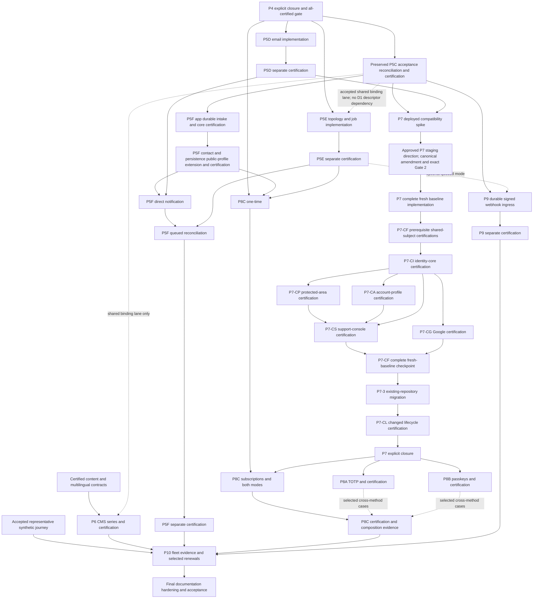

# Remaining program incremental delivery plan

**Status:** Approved program direction, published as a delivery plan on 2026-09-16. All 28 increments retain their outcome, ownership, RED/GREEN, review and acceptance structure. Exact implementation plans, final diffs, certification and external actions retain their separate gates.

**Goal:** Deliver the remaining accepted program as usable, reviewable increments while preserving capability identities, dependencies, historical compatibility, certification and human gates.

**Scope:** P5D, P5E, P5F, P6, P7, P8A, P8B, P8C, P9 and P10. P5C is an existing predecessor stream, not a new assignment. P5A and P5B retain their relocation to P3B.

**Architecture:** Follow the accepted functional core, imperative shell, consuming-boundary-owned ports, finite installed snapshots and state-last lifecycle. Use existing generated modules and private builder owners; create no generic backend framework or unused service, schema, package, Worker or test harness to make the schedule look smaller.

**Execution:** Use the repository's [review and contribution protocol](../governance/review-and-contribution.md). This delivery plan defines the sequence; it does not start implementation or authorize commits, provider actions or deployment. The historical P4 plan supplies structure, not restart instructions or transferred approvals.

**Companion:** [First eligible planning increment and execution prompt](2026-09-16-email-delivery-contract-plan.md). [Recorded decisions and engineering rationale](2026-09-16-remaining-program-decisions.md) own the user's answers and their bounded interpretation.

## 1. Bound baseline and preserved work

This plan was prepared against accepted main `991ab80bf071d9671bd9c465c01f2ca83d253234`, verified on 2026-09-16. It includes optional persistence through PR #129 and accepted ADR-0016. Preserve existing implementation, historical snapshots, certification records and work in progress; this plan does not restart P5C.

At this baseline, the default app retains six accepted local receipts and four pending external outcomes. Current admission has five certified and six pending subjects: standards, deployment-cloudflare, application-persistence, analytics, booking-calendly and observability are pending. These are dated observations, not permanent counts or newly accepted evidence.

Accepted ADR-0016 owns local-first D1, finite persistence-specific standards/deployment tuples, the Node-hosted Wrangler binding lane and machine-then-human export/removal review. Future Queue, D1/R2 and identity capabilities choose compatible runners at their own gates.

**Existing acceptance-record conflict:** persistence is integrated, while the roadmap still records P4 as open and requires its acceptance before persistence integration. The owning closeout must reconcile those facts before downstream runtime admission. This planning publication infers no waiver and changes no historical status or evidence.

### Eligibility now

D1/D2 are answered. First remaining work: **P5D-1, the exact email contract amendment and P5D-2 implementation plan**. No in-scope runtime increment is currently admitted by the inspected acceptance record. P4 closure/reconciliation, exact predecessors and the approved implementation plan remain entry conditions. D12's initial-composition staging exception is explicitly approved as a planning direction on 2026-09-16; its bounded rule is recorded in the [review protocol](../governance/review-and-contribution.md#initial-authenticated-composition-exception) and named in the roadmap. P7-2 still requires acceptance of those canonical changes and its exact Gate 2 plan.

The [decision record](2026-09-16-remaining-program-decisions.md) supplies current answers and rationale. Refresh these dated observations against current accepted main at the owning preparation gate.

## 2. Source and plan maturity inventory

Preparation inventory before this delivery plan was published. Canonical owners inspected: root instructions; approved source plan, particularly sections 2–4, 9, 13–19 and 21–23; program roadmap; architecture overview; capability model; review protocol; accepted ADRs 0001–0016 and their explicit supersession links; package ownership; enforcement map; current catalog, recipe, generation, verification and certification contracts; relevant builder/CLI instructions. The P4 private example and P5C private plan/handoff were inspected separately as planning evidence.

| Surface | Maturity | Treatment |
| --- | --- | --- |
| Historical detailed P4 plan | Detailed nine-increment historical implementation plan with exact files, RED/GREEN, predecessors, per-increment review, claims and recovery | Reuse those structural qualities. Do not reuse its restart, old recipe versions, old pending counts or old authorization. |
| Existing P5C implementation and separate certification handoff | Detailed implementation, now integrated, with separate certification handoff | Consume its implemented boundary and exact accepted certification outcomes as available; do not decompose or restart P5C. |
| P5D / P5E / P5F | Capability outcomes and phase outlines in source-plan section 13 and roadmap | Need the coherent delivery splits below. No matching detailed increment plans were found in the preparation inventory or accepted-main tree. |
| P6 | Content authority and CMS outline, with important cutover gate | Needs compatibility, protected shadow operation, then atomic authority transfer. |
| P7 | Rich product/security requirements and required deployed spike; no detailed increment plan found | Needs security policy, a real compatibility decision, independently certified capability subjects and final recipe convergence. |
| P8A / P8B | Independent assurance outcomes; mechanism and recovery policies not fully decided | Small number of complete security slices; no enrollment-only release. |
| P8C | Detailed mode/dependency/domain outline and risk-based scenarios | Needs complete one-time behavior, subscription behavior, then combined-mode migration; several business policies require answers. |
| P9 | Signature/idempotency/normalization/replay outline and explicit separate deployed certification | Needs complete synchronous durable ingress before optional queue composition. |
| P10 | Evidence-led fleet, recovery, extraction, portability and documentation-hardening outline | Define evidence-producing increments now; name actual repairs only from measured findings. |

At the preparation baseline, the source plan referred to existing P5C–P5F “capability prompts”; no separate P5D–P5F prompt files were located in the inspected locations. The source-plan reference now points to this delivery plan while preserving the existing P5C handoff. This dated preparation inventory does not replace an additional approved plan if one is subsequently identified. If an additional approved plan is supplied, reconcile it before replacing its requirements or gate.

## 3. How to read the sequence

Increment suffixes below are **delivery-plan references**, not replacements for phase or capability identifiers. They must not become executable names, commands, package names, fixture names or source paths.

### Gate and evidence conventions

These conventions apply to every row and card below; they reference existing owners rather than introduce another lifecycle policy.

- **Accepted predecessor** means an explicit acceptance artifact, accepted revision ancestry and applicable terminal evidence under the protocol's direct-predecessor gate. “Implementation exists,” a green PR or a local receipt alone is insufficient.
- **Implementation series:** numbered increments can compose one capability implementation task. Each gets its own verified-diff checkpoint. The capability remains pending until its separately identified certification task; no downstream capability consumes an uncertified dependency except an explicit canonical exception. The approved P7-only initial-composition plan is detailed in its card and amendment; it becomes operative only after the canonical amendment and exact Gate 2 acceptance, and does not authorize other phases to bypass certification.
- **R review:** protocol-required independent requirements, architecture/anti-overengineering and test-evidence scopes, after the plan-authorized bounded `@ponytail-review`. Security/data specialists are added only for a material gap in those scopes. Reviewers cannot approve their own work or authorize external action. The current planning task does not invoke Ponytail.
- **L lifecycle evidence:** actual compiled create and applicable add/remove/re-add, supported upgrade and transition scenarios; exact state/inference agreement; dirty/drifted/unknown tuple/unsupported-edge refusal; reference and ownership checks; zero mutation before writes; retained-prefix recovery after writes; migration-before-state, final byte inspection and Gate 3. Use the existing operation-specific owners, not a generic executor. Never invent an earlier version merely to demonstrate an upgrade.
- **G generated evidence:** generated Vitest Node contracts and jsdom behavior where relevant, actual Next/OpenNext build and whole-Worker tests, capability-owned binding tests, real-browser/axe tests for affected routes/forms, and immutable representative fixtures. Use Node's test runner for authored builder/CLI/governance tests. Preserve historical Vitest 4 behavior and new Vitest 5 inputs; do not silently migrate a generation.
- **S subject handling:** when descriptor or required-evidence identity changes, calculate exact affected subjects and create/renew their task-linked pending records without carrying certificates across digests. Preserve unchanged records, default/retained snapshots and accepted receipts. A changed renderer/workflow/lock may also require evidence renewal even if a descriptor digest is unchanged; audit causal coverage, not only hash equality.
- **C certification:** separate task, private Gate 1 human-prerequisite runbook, exact Gate 2 plan, base fresh-scaffold journey and advertised compiled lifecycle. Add protected staging/provider/security/persistent-data/cleanup outcomes when behavior needs them. Run admission, changed-record private-artifact validation and relevant closure checks. Only accepted exact-subject evidence permits registry promotion. New workflow source is implementation; executing it and accepting its outcomes are separately authorized certification work.

Proposed commit/PR scopes are review units, not authority to create Git objects or external PRs. Typically one increment forms one PR if requested, with only necessary coherent commits. A certification task has its own comparison and PR if requested. Shared-subject renewals can coordinate one scenario, but retain separate subject assertions, reviews and accepted outcomes.

Every production or provider action still has its separate authorization, target identity and recovery boundary under ADR-0011 and the protocol. Keep these controls with the feature's first executable behavior. P10 may improve demonstrated weaknesses; it is not the first owner of safety.

### Per-increment execution structure and gates

The original P4 plan's outcome → exact files → RED → minimum implementation → GREEN → review packet → `verified-final-diff-approval-required` structure applies here. The [review protocol](../governance/review-and-contribution.md) remains the normative owner; the following is this proposal's execution checklist, not an alternate policy. Each card supplies its own behavioral tests and acceptance boundary.

1. **Gate 1 — preparation and predecessor admission.** Bind accepted main, worktree and comparison; read current owners and official sources; record the direct predecessor's explicit approval, accepted ancestry and applicable machine admission. An open gate stops runtime, even if the previous PR merged. Preserve the stated independent scheduling and declared capability dependencies.
2. **Gate 2 — exact plan.** Freeze the card's concrete file allowlist, real source/target tuples, interfaces, RED/GREEN commands, safe intermediate state, coherent commit/PR proposal, reviewers, subject delta and recovery. Use the companion's exact planning-file scope for P5D-1. For later increments, resolve filenames from then-current owners; this program plan does not approve a speculative file list.
3. **RED, then minimum implementation, then GREEN.** Use each card's checkpoints and field 5. Record an actual expected missing-behavior failure before code, then the smallest passing change and the full relevant owning verification once on the settled candidate. A proof, documentary plan or evidence-only certification uses an explicit evidence gap and meaningful validation instead of an artificial failing source-text test. Expanding P10-2 creates this complete structure for each evidenced repair.
4. **Freeze and independently review.** Record base/candidate identity, staged/unstaged/untracked and relevant ignored inputs, file inventory and content/patch digest. Follow R: the approved comparison receives the protocol's plan-authorized bounded complexity review and independent requirements, architecture/security/privacy/anti-overengineering, and test-evidence scopes. Validate each finding; repair only material in-scope defects; refresh affected checks and reviews after a changed candidate.
5. **Gate 3 — exact acceptance packet and stop.** Include RED/GREEN or evidence-gap/results, comparison/files, all reviewer dispositions, ownership/compatibility, risks/deferrals, recovery and certification delta. Stop at `verified-final-diff-approval-required`. Approval of this program plan does not approve a future diff, advance automatically, commit, create a PR or authorize external action.
6. **Certification handoff.** Implementation acceptance does not close certification. Section 7 supplies separately planned, reviewed and accepted exact-subject tasks. Keep those tasks' Gate 1 human prerequisites, Gate 2 journeys and approvals, genuine supported baseline, causal assertions, failure/recovery and resource disposition separate from the implementation comparison.

The checkboxes are future executor checkpoints, not claims that this planning session ran tests or accepted the work. A card is **planning-ready** when its outcome, boundaries, dependencies and gate inputs are defined; it becomes **execution-ready** only after its concrete entry conditions and exact Gate 2 plan are accepted. Any unresolved program-level design decision remains explicitly blocked.

## 4. Requirements-to-increments coverage map

The source paths below are canonical. This map is a traceability index, not a second normative specification.

| Requirement and canonical source | Delivery | Acceptance / certification |
| --- | --- | --- |
| Preserve P5A/P5B relocation, P5C stream, exact P4 closure; roadmap relocation ledger and P4/P5 | Baseline above; P5D-1 admission contract; all entries | No P4/P5C restart, renumbering or inferred exception; existing P4 and P5C gates |
| Email sender, Resend adapter, environment/domain validation, idempotency, normalized outcomes/errors, private telemetry, contract tests, operational removal; source §13 | P5D-1–3 | P5D-C plus changed shared subjects |
| Email independent on portfolio/site/app; app-foundation dependency; future authenticated default; capability catalog | P5D-1 resolves public-profile admission; P5D-2/3 implement current profiles; P7-2 adds authenticated recipe support | No silent portfolio/site-to-app transition; P5D-C, then P7-CF renewal |
| Job dispatch/handler contracts, Queue, retry/terminal failure, deduplication, reconciliation, isolation; source §13 | P5E-1–3 | P5E-C; Queue replay and retention evidence |
| Jobs topology only from evidence, no automatic `apps/jobs`; source §6/13 and ADR-0005 | P5E-1; selected topology in P5E-2 | Explicit topology decision and Cloudflare/runtime evidence |
| Public-profile dependency-only persistence required by contact and later site payments; capability catalog | P5F-2, extending accepted persistence and contact after their complete app-baseline certification | P5F-CP before public-profile consumption; no P5C restart |
| Durable accepted contact before success; Turnstile, limits, status, retention/deletion, no body logs; source §13 | P5F-1; public-profile extension P5F-2 | Core test/abuse/data gate; P5F-C0, P5F-CP and final P5F-C |
| Stable contact application event for optional integrations; source §13 | P5F-1 defines the minimal post-commit event; P5F-3/4 consume it | No pre-commit emission or sensitive payload; P5F-C0 and P5F-C |
| Contact email optional, queue optional, notification failure cannot undo acceptance; source §3/13 | P5F-3/4 | Persistence/send/enqueue crash boundaries; P5F-C |
| CMS embedded in Next, separate CMS_DB/R2, owned content/roles/access, drafts/versions/live preview; source §14 | P6-1/2 | Protected editorial gate; P6-C |
| File import, normalized parity, sole authority after approval, both multilingual installation orders, export/ejection/recovery; source §14/18 | P6-2/3 | Staging parity, cutover and reverse-export gate; P6-C |
| Better Auth/Next/OpenNext/D1/Drizzle deployed security spike; source §15 | P7-1 | Compatibility/security decision before identity product code |
| Verified email/password, recovery, sessions/list/revoke, server authorization, anti-enumeration/abuse, audit/data safety; source §2/15 | P7-2 under the approved D12 initial-composition direction | P7-CI and P7-CP, separately for identity-core and protected-area |
| Google sign-in and safe account linking; source §2/15 | P7-2 Google work package | P7-CG |
| Account/profile CRUD, user/admin roles, export/delete hooks and ordinary-personal-data controls; source §2/15 | P7-2 account work package | P7-CA; cross-capability deletion policy retained |
| Narrow support console, session revoke, suspend/restore, audit, conditional contact/billing views, bounded confirmed privileged reconciliation; source §15 | P7-2 support work package; billing extension P8C-2/3 | P7-CS; later material support-console renewal |
| Full authenticated-app recipe, app-to-authenticated migration, independent optional capabilities; source §2/18 | P7-2 fresh baseline; P7-3 migration | P7-CF then P7-CL for every changed subject plus explicit P7 closure |
| Independently selectable/addable TOTP and recovery codes; source §15/21 | P8A-1 | P8A-C and exact affected identity renewal |
| Independently selectable/addable passkeys and recovery; source §15/21 | P8B-1 | P8B-C and exact affected identity renewal |
| Hosted Checkout, payment projection, idempotent receipt/jobs, entitlement projection, failed payment/refund/reconciliation, no card data; source §16 | P8C-1 | P8C-C |
| Subscriptions, Customer Portal, BillingSubjectProvider, cancellation/effective periods/synchronization; source §16 | P8C-2 | P8C-C; no Better Auth coupling in billing |
| Both modes, one-time-to-both, assurance combinations, separate environment endpoints and operational removal; source §16/18 | P8C-1–3 | P8C-C and changed support/identity/provider subjects |
| Signed Calendly events, durable idempotent receipt, normalization, cancellation/replay/optional queue, recovery; source §18/21 | P9-1/2 | P9-C, independent of booking-calendly certificates |
| Source/data/provider rollback separation, retained/ejected work, state-last and compiled lifecycle; ADR-0003/0006/0007, source §9/18 | Every behavior's own increment; L; P10-3 drills | Per-increment review and separate affected C task |
| Current-major/previous-major upgrade coverage, combinatorial state properties when justified; source §9/18/21 | Named actual edges at each lifecycle increment; P10-1/2 | No invented previous major; replayable properties only if materially useful |
| Fleet measurements, package reassessment, evidence-backed simplification, selected real-fleet certification, bounded portability; source §21/P10 | P10-1–4 | Named decisions, affected certification renewals, P10 final approval |
| Deferred performance budgets and no performance claim; accepted P2 amendment / source §18 | Preserve deferral; explicit disposition in P10-1 and P10-5 | Measure/calibrate only if separately selected; never imply the deferred obligation disappeared |
| Permanent documentation hardening at end of final task; roadmap P10 | P10-5 | Scanner/owner/history checks and final phase packet |
| Copy/localization, accessibility policy, privacy, least privilege, publication boundaries; ADR-0004/0005/0008–0012/0014 | Every affected feature from first exposure; G/R/C | No automatic WCAG, legal, provider-availability or production-readiness claim |

## 5. Complete proposed order and dependency map

### Default serial delivery order

This is a scheduling order. It does not add capability dependencies. Existing explicit independent tracks remain available after their real prerequisites, with one shared-contract mutation stream and sequential merges.

1. Use the recorded answers to finish P5D-1's exact planning artifact. Existing owners reconcile P4 acceptance and complete P5C certification; persistence integration already exists. This task does not perform their closeout.
2. P5D-2 → P5D-3 → P5D-C. P5D needs accepted P4, not D1. Serialize against P5C's standards/deployment/catalog changes if their scopes overlap.
3. P5E-1 → P5E-2 → P5E-3 → P5E-C. Reuse the accepted binding lane only after its ownership/runner decision is reconciled.
4. P5F-1 → P5F-C0 → P5F-2 → P5F-CP → P5F-3 → P5F-4 → P5F-C. First deliver and separately certify complete app-only contact on certified P5C. Then extend those already-accepted contact/persistence implementations together to public profiles and separately certify the new subjects. Only then add optional notifications. This avoids an unused dependency-only persistence baseline with no selectable consumer.
5. P6-1 → P6-2 → P6-3 → P6-C.
6. P7-1 → accepted canonical staging amendment and exact Gate 2 → P7-2 complete fresh baseline → prerequisite shared-subject certification within P7-CF → P7-CI → P7-CP/CG/CA after their actual dependencies → P7-CS after CI/CP/CA → P7-CF final composed-baseline checkpoint → P7-3 migration → P7-CL lifecycle renewal → explicit P7 closure. The user approved only this initial-composition implementation start-order exception. Section 7 makes the shared-subject and identity certification order explicit; all other gates remain.
7. P8A-1 → P8A-C; P8B-1 → P8B-C; P8C-1 → P8C-2 → P8C-3 → P8C-C. Their independent readiness is shown below; the serial ordering is a low-conflict default.
8. P9-1 → P9-2 → P9-C.
9. P10-1 → P10-2's evidence-selected repairs and separate renewals → P10-3 → P10-4 → P10-5 → final program acceptance.

If an optional integration is not selected in a generated project, it stays absent; implementing its program support does not select it for users. A slice within one implementation series is not represented as phase completion before the entire required series and certification close.

### Hard dependencies and delivery dependencies

P6 is not an architectural dependency of P7. P7 requires persistence and email, not jobs or contact. TOTP and passkeys have no dependency on each other or Stripe. One-time billing does not require customer identity; subscriptions require the stable billing-subject contract. Booking webhooks do not require identity, CMS, payments or the front-end Calendly embed. Dotted edges are delivery/test-lane or optional-composition constraints, never new descriptor dependencies.

The [catalog](../architecture/capability-model.md#initial-catalog) remains the support/dependency authority. P7-2/3 must implement and separately renew authenticated-app support for already delivered optional capabilities only where that catalog declares it; they stay unselected by default. In particular, do not accidentally add protected-area as an account-profile descriptor dependency, or widen booking-webhooks from its declared app/authenticated-app scope to public profiles. P7 certification follows the real declared graph under the accepted D12 staging direction. P7-CF is an existing coordination reference: its prerequisite shared-subject outcomes occur before dependent identity certification, and its final composed-baseline checkpoint follows the five identity outcomes. It is never a composite certificate.

Accepted main now allows future binding capabilities to choose compatible runners at their own gates. Apply D3's recorded coverage and maintenance criteria; preserve the P5C and whole-built-Worker lanes. An unproved capability-specific check remains a blocker, not a reason to add another runner incidentally.

## 6. Delivery increment cards

### P5D — `transactional-email-resend`

#### P5D-1 — Settle the email contract and acceptance boundary

1. **Outcome / exclusions:** Approved semantics for a server-only sender, public-profile dependency admission, safe outcome/retry behavior, and the next exact-file plan. No descriptor, library, template, endpoint, secret, provider call or certification change.
2. **Predecessor:** Use recorded D1/D2 answers and prepare the exact amendment/plan checkpoint. Planning may proceed while P4 finishes; runtime remains gated. Read accepted ADR-0016 and reconcile the closeout conflict; do not re-ask D1/D2.
3. **Owners:** Capability model for detailed behavior, source plan for outcomes, roadmap for sequence, existing ADR owners for any explicit extension, enforcement map for planned evidence. The companion identifies exact documents and current code consumers to inspect.
4. **Intermediate / compatibility:** All executable bytes and accepted evidence remain unchanged. Existing recipes and historical snapshots continue their present behavior.
5. **Tests / recovery:** Link and owner consistency, complete requirement coverage, no claim that planned checks passed, unchanged executable/registry snapshot. Undoing a proposed paragraph is ordinary document revision, not Git or provider recovery.
6. **Commit / review / checkpoint:** One planning-document amendment candidate if separately approved; R scope is documentary. Present exact amendment and implementation plan for approval; do not start P5D-2.
7. **Subjects / obligations:** None change. Name likely app-foundation, standards and deployment renewal without assigning future versions or resetting records.

**Execution checkpoints** — use section 3's per-increment gate with this card's ownership and claim boundary.

- [ ] **Evidence gap:** Record the mismatch between catalog support for public-profile email and app-only executable foundation admission; identify missing sender outcome semantics.
- [ ] **Minimum change / implementation:** Prepare the D1/D2 owner-consistent documentary amendment and exact P5D-2 handoff within the companion's file scope. No executable subject changes.
- [ ] **GREEN / acceptance evidence:** Validate requirement/owner links, unchanged executable inputs and the proposed subject map; present the documentary candidate and next plan at their separate approval checkpoint.

#### P5D-2 — Generate a usable, safe transactional sender

1. **Outcome / exclusions:** Explicit email selection generates the complete `TransactionalEmailSender`, Resend adapter, in-memory adapter, configuration validation, normalized outcomes and operational guidance. Include meaningful adapter contract usage in tests; create no demonstration send endpoint, contact form, identity flow, queue, database, marketing system or public wrapper package.
2. **Predecessor:** Accepted P5D-1 and P4 closure. Reconcile any integrated P5C shared-tuple changes before freezing exact files. P5C is not a runtime dependency of email.
3. **Owners:** Generated email application/infrastructure/composition; builder catalog/settings/renderer/locks/inference; standards test ownership; deployment environment ownership; thin CLI selection. Foundation support for explicitly selected public-profile backends is updated at its canonical owner, subject to D1.
4. **Intermediate / compatibility:** Work on current exact supported generations; preserve portfolio/site identity, page/content bytes and independently selected website capabilities. Unselected generation is unchanged. Never set installed/certified state for a stub. Existing-repository email application remains refused until P5D-3. Missing configuration fails before send; no secret in project/state or browser code. API acceptance is not inbox delivery. D2 controls retries and uncertain outcomes.
5. **Tests / recovery:** Valid/invalid sender domain, invalid address/header injection, absent secret, malformed provider response, timeout after possible acceptance, auth failure, throttling, transient/permanent errors, same-key replay/conflict, cancellation and redacted diagnostics. G includes real generated Worker composition with intercepted transport and preserved non-email fixtures. A send cannot be undone by source rollback; later provider verification owns real message/credential disposition.
6. **Commit / review / checkpoint:** One coherent fresh-generation PR scope, including exact consumed dependencies/locks, descriptors, CLI selection, generated tests and truthful docs; R with privacy/security coverage. Accept usable fresh generation only.
7. **Subjects / obligations:** S for email and any materially changed shared foundation/standards/deployment subject. All new/changed subjects remain pending for P5D-C; no inherited P4 certificate.

**Execution checkpoints** — use section 3's per-increment gate with this card's ownership and claim boundary.

- [ ] **RED:** Prove that supported explicit email selection lacks the complete sender, and that missing configuration, ambiguous acknowledgement and same-key conflict cannot be reported as successful delivery.
- [ ] **Minimum change / implementation:** Implement the selected-profile foundation admission, sender, real adapter, memory adapter and required configuration/locks as one fresh-generation contract.
- [ ] **GREEN / acceptance evidence:** Run owning builder/CLI contracts, generated sender contracts and actual Worker composition; preserve non-email and historical behavior. Accept fresh generation only; existing-repository application remains refused.

#### P5D-3 — Add, remove and re-add email without losing client work

1. **Outcome / exclusions:** Existing supported repositories can plan/apply email addition and reviewed source removal/re-addition through the existing CLI lifecycle. Operational removal guidance accounts for domain configuration, credentials and provider-retained messages. No automatic provider deletion, mail recall, generic settings transport or invented upgrade edge.
2. **Predecessor:** Accepted P5D-2. Other dependency subjects must be accepted for the exact target tuple; a shared change still in this implementation series remains pending for its named coordinated certification.
3. **Owners:** Operation-specific builder planners/executors, finite installed catalog selection, package/reference guard, migration/state controls and CLI argument adaptation.
4. **Intermediate / compatibility:** Preserve installed provenance, unrelated dependencies, content, ejections and P5C tuples. Dependency-in-use and unknown package references refuse. Remove only email-owned members, never the shared foundation still needed by another capability. Provider disposal is a separate recorded decision.
5. **Tests / recovery:** L plus real sender/runtime checks after add/re-add, package-backed reference refusal, changed application templates, missing/changed plan inputs, exact managed member removal and partial-write recovery. No automatic rollback after a retained write prefix.
6. **Commit / review / checkpoint:** One lifecycle PR scope; R with ownership/reference/privacy focus. Gate 3 accepts the implementation candidate and its limitations; certification is next.
7. **Subjects / obligations:** Refresh email's exact evidence contract and changed shared subjects as needed. P5D-C certifies fresh generation and compiled lifecycle plus separately approved Resend outcomes.

**Execution checkpoints** — use section 3's per-increment gate with this card's ownership and claim boundary.

- [ ] **RED:** Exercise compiled addition/removal against real generated projects, including surviving shared users, client edits and failed writes; capture the actual missing lifecycle behavior.
- [ ] **Minimum change / implementation:** Connect email to existing operation-specific planners, reference checks, state-last writers and reviewed provider-disposition handoff.
- [ ] **GREEN / acceptance evidence:** Run L and generated send checks after add/re-add; demonstrate refusal before mutation and retained-prefix recovery. Freeze the complete implementation for separate P5D-C.

### P5E — `background-job-delivery`

#### P5E-1 — Prove and choose Queue consumer topology

1. **Outcome / exclusions:** A bounded compatibility receipt shows whether a consumer can safely execute with the primary OpenNext Worker or needs its own Worker. This is a test-only proof with synthetic jobs, no product event bus or placeholder domain handler.
2. **Predecessor:** Accepted P4 closure and recorded D3 selection criteria. Reuse the accepted shared binding-lane owner only after proving Queue behavior; jobs gains no D1 dependency. D4 records a separate-Worker preference with an evidence-led topology checkpoint.
3. **Owners:** Cloudflare integration/composition/deployment and capability-owned Queue proof; no new package.
4. **Intermediate / compatibility:** Product generation remains unchanged. The proof cannot become a deployment default. A separate `apps/jobs` is selected only with documented technical, permission, failure, scale, bundle or operational evidence and human approval.
5. **Tests / recovery:** Enqueue/consume, explicit acknowledgement, failure/retry, duplicate/out-of-order delivery, missing binding and environment isolation against actual local Queue runtime; whole OpenNext Worker integration if proposed. Retain failed evidence; remove only identity-owned disposable proof data under its approved scope.
6. **Commit / review / checkpoint:** One bounded proof/decision review unit; R with Cloudflare specialist only if necessary. Stop for topology decision D4 before product configuration.
7. **Subjects / obligations:** Test-only proof does not certify Queue behavior or change descriptors. If shared test configuration must change, isolate and review that actual subject delta; P5E-C remains required.

**Execution checkpoints** — use section 3's per-increment gate with this card's ownership and claim boundary.

- [ ] **Evidence gap:** Identify the unproved Queue binding, whole-Worker entry point and permission/failure boundaries; do not treat a unit mock as topology evidence.
- [ ] **Minimum change / implementation:** Build only the smallest synthetic Queue proof that compares the viable deployment choices and compatible existing versus additional runner.
- [ ] **GREEN / acceptance evidence:** Record actual ack/retry/duplicate/failure behavior, operational cost and a bounded recommendation. Obtain the topology decision before any product deployment configuration.

#### P5E-2 — Deliver bounded dispatch, consumption and terminal failure

1. **Outcome / exclusions:** Optional jobs selection materializes `JobDispatcher`, handler contracts, memory and Queue adapters, selected topology, explicit retry/terminal-failure behavior, bounded diagnostics and reconciliation entry points. No business jobs, global retry layer, scheduler, hidden database or unrestricted public replay endpoint.
2. **Predecessor:** Accepted P5E-1 topology and compatible shared lane. Reconcile P5D/P5C catalog, deployment and lock changes serially.
3. **Owners:** Job module, Cloudflare bindings/composition, deployment/configuration owner, builder selection/locks/inference, consuming handler for side-effect idempotency.
4. **Intermediate / compatibility:** Dispatch acceptance is not completed work. Queue delivery may duplicate/reorder; the handler contract requires a stable operation key and a safe repeat policy. No generic durable deduplication store is invented: persistence belongs to consumers that actually need it. No unbounded retry or silent terminal deletion. Payload allowlists and size/retention limits exclude secrets and unnecessary personal data.
5. **Tests / recovery:** G with actual Queue ack/retry/terminal behavior; malformed/unsupported job, poison message, duplicate delivery, timeout after side effect, exhausted retry, missing dead-letter target, cancellation and no body logging. Dead letters remain inspectable and replay preserves original operation identity.
6. **Commit / review / checkpoint:** One complete fresh-generation runtime scope with configuration, tests and operations; R. Retry, terminal disposition, isolation and recovery ship with the first consumer.
7. **Subjects / obligations:** S for jobs and changed deployment/standards/foundation subjects. P5E-C must establish actual deployed delivery and terminal/replay recovery separately.

**Execution checkpoints** — use section 3's per-increment gate with this card's ownership and claim boundary.

- [ ] **RED:** Make dispatch/consume tests fail for missing real Queue behavior, poison-message disposition, duplicate handling contracts and false completion claims.
- [ ] **Minimum change / implementation:** Deliver the chosen consumer topology with stable operation identity, bounded payloads, retries, dead-letter handling and inspectable terminal state together.
- [ ] **GREEN / acceptance evidence:** Run generated contracts and actual Queue/whole-Worker tests, including side-effect/ack ambiguity; accept the complete local runtime while deployed certification remains pending.

#### P5E-3 — Make job lifecycle and operator replay safe

1. **Outcome / exclusions:** L for jobs plus bounded operator inspection/replay/drain handoff with explicit authorization and audit evidence. No generic business dashboard or claim that removing source drains remote queues.
2. **Predecessor:** Accepted P5E-2.
3. **Owners:** Builder job lifecycle, reference guard, deployment topology, generated operator commands and consuming handler contracts.
4. **Intermediate / compatibility:** Removal refuses surviving producers/consumers and unknown references. In-flight, delayed and dead-letter messages require a reviewed retain/drain/discard disposition before source removal; destructive remote disposal remains separately authorized. Replays retain deduplication identity and cannot cross environments.
5. **Tests / recovery:** L plus producer-without-consumer refusal, consumer version/schema mismatch, replay authorization, duplicate replay, partial drain, stale disposition, missing resource, queue failure after source mutation and operator diagnostics. Recovery distinguishes repository prefix, deployed consumer and queued messages.
6. **Commit / review / checkpoint:** One lifecycle/operations scope; R with data/privilege coverage. Accept the exact implementation and source-removal boundary.
7. **Subjects / obligations:** Final S for P5E-C; deployment changes may require their own renewal. Generated runbooks are not executed recovery evidence.

**Execution checkpoints** — use section 3's per-increment gate with this card's ownership and claim boundary.

- [ ] **RED:** Exercise unsafe removal with producers or queued work, unauthorized or cross-environment replay and stale resource disposition.
- [ ] **Minimum change / implementation:** Implement the existing-repository lifecycle and bounded operator replay/drain handoff with preserved operation identity.
- [ ] **GREEN / acceptance evidence:** Run compiled lifecycle and recovery cases; inspect exact retained work/resource obligations. Present implementation acceptance separately from P5E-C's real delivery and replay outcomes.

### P5F — `durable-contact-submissions`

#### P5F-1 — Accept durable, abuse-controlled contact on the existing app baseline

1. **Outcome / exclusions:** A complete app contact form validates input and Turnstile, enforces request/rate bounds, persists a minimal submission and returns success only after commit. Include status, retention/deletion, authorized read/export and a stable post-commit application event for optional integrations. No email, queue, attachments, account requirement or public-profile persistence extension yet.
2. **Predecessor:** Certified exact P5C application-persistence and shared app foundation; D5 field/privacy/abuse/lifecycle decisions. Existing P5C remains the implemented predecessor, not work to restart.
3. **Owners:** Contact application/domain, D1 repository and real schema/migration, validated form/copy, Turnstile adapter, builder lifecycle and persistence export/removal consumers. The stable event belongs to contact; use a minimal submission identifier and event identity, with no message body or generic event bus.
4. **Intermediate / compatibility:** Complete usable app intake works without optional email/jobs. Public-profile selection remains explicitly unsupported until P5F-2. Event observation occurs only after persistence and cannot change an accepted submission into a failure. Access controls and private diagnostics accompany the first stored record; retries after an ambiguous response use bounded deduplication. Removal accounts for retained submissions before source/state changes.
5. **Tests / recovery:** G/L, streaming oversize bodies, token expiration/replay/wrong hostname, challenge-service failure, rate-limit races, malformed input, D1 failure, duplicate retry after lost response, unauthorized read/export/delete, retention and restore/readback. Verify no event before commit, stable event identity and no sensitive event/log payload. Before-commit failure has no success; notification consumers are absent.
6. **Commit / review / checkpoint:** One complete app durable-intake slice including local lifecycle and data-safety controls; R with security/data expertise where needed. A separate P5F-C0 task certifies this actual minimal supported baseline before widening it.
7. **Subjects / obligations:** Contact and materially changed shared subjects become pending for P5F-C0. The accepted P5C subject remains independent. Public-profile and optional-notification obligations remain open and prevent P5F phase closure.

**Execution checkpoints** — use section 3's per-increment gate with this card's ownership and claim boundary.

- [ ] **RED:** Demonstrate missing durable acceptance and catch acknowledgement before commit, pre-commit event emission, abuse bypass and unauthorized data access.
- [ ] **Minimum change / implementation:** Deliver the app-only intake, real schema, post-commit event and status/export/retention/deletion controls together, without optional notification infrastructure.
- [ ] **GREEN / acceptance evidence:** Run intake browser/Worker/D1 and compiled lifecycle tests, ambiguous-response deduplication and restore/readback. Accept this complete app baseline and hand it to P5F-C0 before profile widening.

#### P5F-2 — Extend the accepted contact and persistence pair to public profiles

1. **Outcome / exclusions:** Supported current portfolio/site contact selection brings the required foundation and dependency-only persistence while preserving public content/profile behavior. Extend the already implemented and certified contact/persistence pair together; do not expose persistence as a direct public-profile option or construct an unused certification scaffold.
2. **Predecessor:** Accepted P5F-1 and P5F-C0; certified P5C; approved D1 public-profile foundation boundary with its accepted evidence. At Gate 1 verify how the direct-predecessor rule applies to the exact changed shared subjects before admitting a dependent extension; if an additional prerequisite certification is required, identify its genuine supported baseline and obtain acceptance first. No gate waiver is inferred from calling this one increment.
3. **Owners:** Existing persistence and contact snapshot/admission owners, generated foundation/runtime verification, resolver/locks, deployment bindings, CLI and actual lifecycle. Preserve P5C's accepted local-first/export-removal choices; no business-table or runner redesign.
4. **Intermediate / compatibility:** Both components already work together on the certified app baseline. Their public-profile widening is one compatibility change, with separate pending subjects and later causal certification assertions. Preserve defaults, historical generations, origin content and selected optionals; refuse partial/mixed unsupported tuples. No automatic remote D1 action or profile conversion.
5. **Tests / recovery:** Fresh portfolio/site contact and compiled existing-project addition; multilingual/content/route preservation; exact dependency inference/locks; APP_DB identity and wrong-target refusal; partial failure, reference-protected removal, source/export/restore and database loss boundaries. Exercise real public consumers, not a manually forced impossible persistence-only selection.
6. **Commit / review / checkpoint:** One consumer-driven compatibility-extension scope with R. Separate P5F-CP tasks certify the changed persistence and contact subjects and any other material shared subject before optional notification work or downstream public-profile payment use.
7. **Subjects / obligations:** New exact contact/persistence public-profile subjects are pending until P5F-CP. Retain P5C/P5F-C0 historical evidence and reuse only still-applicable causal evidence. This is an extension of accepted work, never a restart of P5C.

**Execution checkpoints** — use section 3's per-increment gate with this card's ownership and claim boundary.

- [ ] **RED:** Use actual portfolio/site contact selection to expose missing dependency-only persistence support; include content preservation and wrong-database refusal.
- [ ] **Minimum change / implementation:** Extend the already accepted contact/persistence pair through finite supported snapshots, actual public consumers and operation-specific lifecycle.
- [ ] **GREEN / acceptance evidence:** Run fresh and compiled public-profile journeys plus export/restore and managed-member/refusal checks. Accept the extension with separate pending subject renewals for P5F-CP.

#### P5F-3 — Notify after persistence with optional email

1. **Outcome / exclusions:** When email is installed and notification explicitly enabled, the contact-owned post-commit event triggers a localized contact-specific notification. No queue, authentication-email reuse, or new public sender endpoint.
2. **Predecessor:** Accepted P5F-2 and P5F-CP, and certified P5D.
3. **Owners:** Contact notification use case/template/status, its stable event and email sender adapter; the contact domain's acceptance contract is unchanged.
4. **Intermediate / compatibility:** Sending follows persistence. Failed or uncertain notification leaves the accepted submission and its success intact, with a recoverable delivery state. Dedupe/retry uses the same logical operation key; token/email policy stays separate from future identity flows.
5. **Tests / recovery:** Persist/event/send order, rejection/timeout/unknown acceptance, repeat submission, repeated notification attempt, missing configuration, localized content and private logs. Operator retry requires authorization and acknowledges provider idempotency expiry; no claim of exactly-once delivery.
6. **Commit / review / checkpoint:** One optional-composition scope with existing-repository enable/disable/removal interactions and R. Safe core behavior remains usable without email.
7. **Subjects / obligations:** S for changed contact and only genuinely changed email contracts; final P5F-C records core and direct-notification outcomes separately.

**Execution checkpoints** — use section 3's per-increment gate with this card's ownership and claim boundary.

- [ ] **RED:** Make optional contact notification expose wrong persist/send order, changed submission success after failure and unsafe logical-send identity reuse.
- [ ] **Minimum change / implementation:** Connect the accepted post-commit event to contact-owned localized templates and recoverable delivery state through the certified email contract.
- [ ] **GREEN / acceptance evidence:** Exercise rejected, uncertain and repeated sends without losing accepted submissions; verify enable/disable and removal behavior with email absent and present.

#### P5F-4 — Reconcile queued notifications across the commit/enqueue gap

1. **Outcome / exclusions:** With email and jobs installed, notification work from the same stable contact event is durably discoverable, dispatched, retried and reconciled after submission acceptance. No generic outbox framework or background-business platform.
2. **Predecessor:** Accepted P5F-3 and certified P5E. Changes within the same contact implementation series do not begin a new uncertified dependent capability.
3. **Owners:** Contact-owned outbox/delivery state and repository transaction; jobs transport/handler; sender; conditional support-console consumer later.
4. **Intermediate / compatibility:** Submission plus notification intent must commit atomically, or an equivalently evidenced recoverable mechanism must be approved before activation. Queue/send failure cannot lose the accepted submission or silently lose notification intent. Queue payloads carry minimal references. Enable/disable or remove email/jobs only after dependency and outstanding-work disposition checks.
5. **Tests / recovery:** Crash after database commit/before enqueue, enqueue accepted/ack lost, worker crash after send, duplicate/out-of-order delivery, lease/retry races, terminal failure, reconciliation restart, deleted/expired submission and poison intent. Review recovery across D1, Queue and Resend independently.
6. **Commit / review / checkpoint:** One atomic queued-notification scope including migrations, reconciliation and lifecycle controls; R with data safety focus. Do not merge enqueue-only behavior before its lost-work recovery.
7. **Subjects / obligations:** Final contact subject plus material jobs/email/persistence changes remain pending for P5F-C and their separate renewal outcomes.

**Execution checkpoints** — use section 3's per-increment gate with this card's ownership and claim boundary.

- [ ] **RED:** Reproduce loss between commit and enqueue, ambiguous enqueue/send acknowledgement and concurrent reconciliation of the same intent.
- [ ] **Minimum change / implementation:** Commit discoverable contact delivery intent atomically with acceptance, then add dispatch, handler and bounded reconciliation as one recoverable path.
- [ ] **GREEN / acceptance evidence:** Inject every named crash boundary, duplicate and poison intent; verify safe disable/removal and separate D1/Queue/Resend recovery. Freeze the final contact candidate for P5F-C.

### P6 — `cms-payload`

#### P6-1 — Prove the embedded CMS and authority boundary

1. **Outcome / exclusions:** A bounded compatibility proof establishes current Payload/Next/OpenNext plus separate D1/R2 behavior, existing content normalization and protected staff access. It produces a go/no-go contract; no live content authority switch or product scaffold.
2. **Predecessor:** Accepted stable content and multilingual contracts, reconciled D3 binding policy; D6 scope decisions. P6 has no application-persistence descriptor dependency merely because it uses D1.
3. **Owners:** ContentRepository contract at its actual first consuming boundary, Payload/D1/R2 adapters and Cloudflare configuration. Preserve application-customer identity separation.
4. **Intermediate / compatibility:** Existing FileContentAdapter remains authoritative. Test-only synthetic records/media are isolated; no production content or staff credentials are used.
5. **Tests / recovery:** Actual workerd D1/R2, protected read/write, preview authentication, normalization/locale mapping, unsupported media and separate CMS_DB/APP_DB identities. If selected packages fail, retain evidence and stop; do not broaden platforms silently.
6. **Commit / review / checkpoint:** One compatibility/architecture decision unit; R with platform/security gaps covered. Approve chosen adapter/version/cutover contract before product work.
7. **Subjects / obligations:** No certificate from a proof. Any material content/deployment contract change has its own S and separate renewal before a dependent accepted capability relies on it.

**Execution checkpoints** — use section 3's per-increment gate with this card's ownership and claim boundary.

- [ ] **Evidence gap:** Name the unproved Payload/Next/OpenNext, D1/R2 and local-API authorization assumptions against the actual installed content contract.
- [ ] **Minimum change / implementation:** Build the bounded synthetic compatibility proof with separate database/media identities, protected preview and real content normalization.
- [ ] **GREEN / acceptance evidence:** Retain positive and negative runtime evidence and explicit unsupported cases; accept or reject the exact adapter/version/authority approach before product generation.

#### P6-2 — Provide a protected editorial workspace with import, parity and export

1. **Outcome / exclusions:** Embedded Payload supports application-owned collections/globals/blocks, staff roles/access, R2 media, drafts, versions, preview/live preview, deterministic file import and normalized parity/export. Public content still uses files; no dual-write or automatic cutover.
2. **Predecessor:** Accepted P6-1 and exact certified content/multilingual contracts.
3. **Owners:** CMS module and adapters, content schema/normalization, deployment binding surfaces, localized preview UI and media lifecycle. Existing section registry remains the executable composition authority.
4. **Intermediate / compatibility:** Separate CMS_DB and R2, no customer-account sharing. Enforce access on server/local APIs, preview tokens/origins, no public draft caching, media type/size and active-content restrictions, protected storage paths, retention and safe export from first editorial writes. File-to-CMS import never overwrites modified CMS data without reviewed reconciliation.
5. **Tests / recovery:** G, staff/anonymous access matrix, unauthorized local API, draft leakage, bad/partial imports, duplicate import, changed input, locale parity, media missing/orphaned, interrupted export and restore to isolated targets. Exercise multilingual→CMS and CMS→multilingual; neither may drop translated or unknown content.
6. **Commit / review / checkpoint:** One complete protected shadow-workspace scope; R with access/media/data safety. Accept shadow operation and parity evidence only.
7. **Subjects / obligations:** Pending CMS plus exact changed content/multilingual/deployment/standards subjects. P6-C must certify staging cutover and recovery, not merely admin rendering.

**Execution checkpoints** — use section 3's per-increment gate with this card's ownership and claim boundary.

- [ ] **RED:** Expose missing protected editorial behavior, anonymous/local-API bypass, draft leakage, import conflicts and loss in either multilingual installation order.
- [ ] **Minimum change / implementation:** Deliver the protected shadow workspace, typed owned content, media controls, import/parity/export and restore path while files remain public authority.
- [ ] **GREEN / acceptance evidence:** Run staff access, browser/preview, real binding and import/export tests; verify public content remains file-backed and failed imports preserve both source and edited CMS records.

#### P6-3 — Transfer editorial authority and support safe exit

1. **Outcome / exclusions:** An approval-bound import/parity/cutover changes the one editorial authority to Payload; source lifecycle supports reviewed export/ejection/removal and recovery. No silent fallback to stale files after cutover or dual editorial authority.
2. **Predecessor:** Accepted P6-2; exact staging parity and write-freeze/consistency decision before actual cutover. D6 must specify the cache/revalidation and editable-content boundary.
3. **Owners:** Content adapter selection/composition, builder migration/inference/state, CMS import/export and operator runbook. Payload controls only the approved client-editable editorial content; application/security copy has an explicit owner.
4. **Intermediate / compatibility:** Keep read-only files authoritative until the complete approval-bound switch. Preserve source and normalized export; lock/fingerprint authority and content inputs. After switch, unavailable CMS produces the approved failure behavior, not unannounced authority reversal. Removal requires a fresh export and reviewed restore/readback, including media and post-export writes.
5. **Tests / recovery:** L and G, failed parity, concurrent edit, partial import, stale approval, commit/cutover crash, cache publication/withdrawal, CMS outage, export round-trip, database/media recovery mismatch and both locale installation orders.
6. **Commit / review / checkpoint:** One cutover-and-exit implementation scope; R. Execution of a persistent staging cutover remains a separately approved C action. Phase cannot close without accepted parity, cutover, export and recovery.
7. **Subjects / obligations:** Final S; P6-C and separate renewals for every materially changed content/multilingual/deployment subject.

**Execution checkpoints** — use section 3's per-increment gate with this card's ownership and claim boundary.

- [ ] **RED:** Demonstrate refusal of stale parity, concurrent writes and incomplete export; exercise outage and crashes around authority transfer.
- [ ] **Minimum change / implementation:** Implement one approval-bound authority switch plus reviewed export/ejection/removal, cache/revalidation and recovery controls.
- [ ] **GREEN / acceptance evidence:** Run compiled lifecycle, cutover failure injection and round-trip readback; accept implementation only. Actual staging cutover and persistent recovery stay in separately authorized P6-C.

### P7 — Authenticated app and narrow support console

#### P7-1 — Accept deployed compatibility and identity security policy

1. **Outcome / exclusions:** Required deployed Better Auth/Next/OpenNext/D1/Drizzle spike and threat review determine viable cookies/session/adapter/verification behavior. No production account system, teams, payments or generic auth wrapper.
2. **Predecessor:** Certified P5C and P5D plus accepted D7 identity policy; separately approved human-prerequisite runbook, protected non-production environment and external actions before deployment. Jobs/contact/CMS are not prerequisites.
3. **Owners:** Identity adapter, request/authorization boundary, D1 migration owner and deployment proof. Use current installed contracts; do not silently change Effect, Next or test majors.
4. **Intermediate / compatibility:** Only isolated synthetic identities/resources. The spike is evidence, not a supported authenticated profile or capability certificate.
5. **Tests / recovery:** Deployed verified-email/recovery/session lifecycle, cookie/security headers, trusted origins, CSRF, ownership, enumeration/rate-limit behavior, D1 consistency, credential separation and cleanup. Missing provider/security proof blocks product acceptance.
6. **Commit / review / checkpoint:** One spike/decision unit with R and appropriate independent security review. Approve exact compatibility/security decision before identity implementation.
7. **Subjects / obligations:** No certification by association. Changes to existing executable shared contracts require S and their own renewal; product certifications follow P7-2.

**Execution checkpoints** — use section 3's per-increment gate with this card's ownership and claim boundary.

- [ ] **Evidence gap:** Record the unproved deployed adapter/session/email/recovery and origin/abuse assumptions, with synthetic targets and cleanup boundaries.
- [ ] **Minimum change / implementation:** Execute only the separately authorized compatibility/security spike and prepare the explicit identity policy using the approved staging direction; reconcile actual compatibility and prerequisite evidence.
- [ ] **GREEN / acceptance evidence:** Review actual deployed success, security-negative and recovery evidence; a missing required result stops product admission. The spike establishes no capability certificate.

#### P7-2 — Generate the complete authenticated-app baseline

**Approved D12 staging direction (2026-09-16):** Implement this first complete authenticated recipe through focused work packages, then certify each exact subject separately in dependency order before migration or downstream work. Existing prerequisites must already be certified; required shared changes are bounded to this composition. The [canonical protocol exception](../governance/review-and-contribution.md#initial-authenticated-composition-exception) reconciles the protocol, source plan and roadmap without describing these dependent capabilities as independent. This resolves the program-level design conflict; runtime still requires the accepted canonical amendment, accepted P7-1 and the exact Gate 2 plan. No partial supported profile, unused identity scaffolding or general certification waiver is introduced.

1. **Outcome / exclusions:** Fresh generation supplies the complete required recipe: app-foundation, application-persistence, transactional-email-resend, identity-core, identity-google, protected-area, account-profile and support-console. It provides verified individual accounts, Google sign-in, sessions, owned account/profile CRUD/export/delete and the narrow support experience. No organizations/teams, customer uploads, generic admin CRUD, default CMS, payments, jobs, contact or optional factors.
2. **Predecessor:** Accepted P7-1, accepted canonical initial-composition amendment and exact Gate 2; certified existing persistence/email and shared foundation contracts; concrete D7 policy within the approved direction. Reconcile actual accepted shared tuples and profile support. Contact views are included only if the contact capability is installed and certified; jobs/contact remain unnecessary for the base recipe.
3. **Owners:** Distinct identity, Google adapter, protected-area, account-profile and support modules retain their catalog identifiers and consuming ports; their actual D1 tables/migrations, localized pure UI, recipe/catalog/CLI, deployment and tests stay with their owners. No generic identity facade. Implement BillingSubjectProvider only when P8C brings its real consumer.
4. **Intermediate / compatibility:** This is one **atomic first public recipe delivery**. Do not merge an incomplete authenticated-app recipe or unused identity module scaffolding to divide it by layer. Internal work packages below remain separately inspectable and testable, but the callable/generated recipe, complete dependency graph, tests and pending subjects become available together. Unselected/current/historical profiles remain unchanged; existing app conversion still refuses until P7-3. Data migration/deployment/provider operations remain separate from generation.
5. **Tests / recovery:** G includes actual complete generation, memory contracts, D1/whole-Worker integration, browser/axe and negative security cases for every capability below. New-directory generation retains exact state-last behavior. Ejection/export/removal policies and recovery runbooks must be usable for every newly stored data type; capability lifecycle that is not yet executable is explicitly refused until P7-3. No supported upgrade edge is invented.
6. **Commit / review / checkpoint:** One coherent fresh-authenticated-baseline PR scope if requested. Track each capability implementation task and its acceptance evidence separately inside that scope; neither shared code nor one PR merges the subjects. Use focused commits for complete security contracts and one R checkpoint on the coherent candidate. The size is justified by the indivisible default experience, not a license for unrelated work. Separate P7-CI/CP/CG/CA/CS tasks and affected shared-subject renewals follow before P7-3.
7. **Subjects / obligations:** New identity-core, identity-google, protected-area, account-profile and support-console subjects are pending, as are every existing descriptor/evidence contract materially widened for authenticated-app. Inventory exact versions/digests from current code; never use a guessed fixed count. P7-CF coordinates individually accepted shared-subject renewals before each dependent identity certification and closes the composed fresh-generation checkpoint after all five identity subjects are accepted. It has no composite registry identity. Later transition changes require separate causal renewal.

**Capability work packages within this atomic delivery:**

| Owner | Complete behavior that ships with its first exposure | Material tests and recovery |
| --- | --- | --- |
| identity-core | Verified email/password, recovery, session creation/list/revocation, user/admin baseline roles, enumeration resistance, server abuse controls, token expiry/replay controls and identity export/deletion hooks. Identity schema is a persistent-data migration; source removal remains eject-only. | Wrong/expired/replayed verification or reset token; email outage; concurrent recovery/revoke; suspended/revoked account; administrator bootstrap; safe private events; database restore and credential separation. |
| identity-google | Sign-in, explicitly authorized linking/unlinking and fallback. Preserve password-account ownership; validate the selected library's issuer/audience/state/nonce/PKCE and exact redirect/origin contract as applicable. | Account collision/takeover, unverified matching email, wrong callback, stale session, provider outage and last-method unlink/lockout. Reviewed provider token/account disposition is separate from source removal. |
| protected-area | Server-side session, role and resource-ownership checks inside use cases/repositories. Redirects/middleware only improve navigation. Sensitive mutations use the approved CSRF/origin/reauthentication contract. | Direct API/action bypass, cross-user object access, stale privilege/session and revoked/suspended principal. Removal must not make surviving privileged use cases accessible. |
| account-profile | Real owned profile CRUD, bounded authorized export, deletion hooks and explicit retention. Immediate access revocation plus an approved bounded resumable cleanup mechanism must work without a mandatory jobs dependency. | Cross-account access/export/delete, partial hooks, concurrent edits/deletion, tombstone/retry, stale authorization, data export that excludes secrets, retention and restore/readback. Billing/legal retention is added by its real later consumer. |
| support-console | User search; verification/status; session view/revoke; suspend/restore; account/security audit; conditional contact-delivery view and bounded identity reconciliation. All privileged use cases revalidate admin authority, minimize data, audit and explicitly confirm disruptive/destructive actions. Billing UI is absent until installed. | Non-admin direct invocation, stale role, PII bounds/pagination, confirmation mismatch, audit-write failure, duplicate reconciliation, concurrent suspension/session use and wrong target/environment. No generic database browsing or provider dashboard replacement. |

**Internal work order and review checkpoints:** First complete the identity/session contract and its negative tests; then protected access and owned account lifecycle; then safe Google linking/fallback; finally the bounded support use cases and composed recipe. This is a practical serial work order, not a new descriptor dependency graph. Each package has focused RED/GREEN and a recorded contract/diff inspection before the next builds on it. Use coherent commits only when separately authorized. The complete candidate then receives R and its exact Gate 3 checkpoint; no partial supported recipe is merged merely to make the steps smaller.

**Bounded QA:** Reuse one representative complete generated baseline and the existing runner lanes where adequate. Keep real authorization, token/session, account-linking, recovery, deletion, provider-outage and restore assertions at their owning boundaries, then exercise whole-Worker and selected browser/provider integration. Reuse unchanged setup and causal evidence across separate subject tasks; do not replace subject assertions with a generic login smoke or repeat an unchanged full suite for each internal package. Additional fixtures or providers require a specific compatibility or failure case. Stateful protected environments require their own approved plan and resource disposition.

A full fresh recipe precedes its existing-repository migration. Certification uses that real complete profile, with pending co-installed subjects allowed only under the named composition's bounded ordering. Shared-subject prerequisite certification and CI/CP/CG/CA/CS ordering are explicit in section 7; the final fresh-baseline checkpoint stops migration and all consumers of this authenticated baseline until every required subject is accepted.

**Execution checkpoints** — use section 3's per-increment gate with this card's ownership and claim boundary.

- [ ] **RED:** Exercise the complete required recipe and each owner contract, including direct server authorization, token/session failures, cross-user data access and privileged-action audit failure.
- [ ] **Minimum change / implementation:** After the approved staging direction has its accepted canonical amendment and exact Gate 2, implement complete identity-core, protected-area, account-profile, Google and support behavior through the focused internal work packages; expose the full recipe atomically.
- [ ] **GREEN / acceptance evidence:** Run owning builder/CLI and generated D1/Worker/browser/security checks on the complete fresh candidate; refuse existing-project conversion. Gate 3 precedes separate capability certifications and shared-subject renewal.

#### P7-3 — Add the exact incoming migration and complete capability lifecycle

1. **Outcome / exclusions:** Bounded app-to-authenticated-app migration and applicable later additions/removals/ejections preserve public experience, account data and independent capabilities. No guessed source/target version, historical major, reverse profile transition or automatic provider/data action.
2. **Predecessor:** Accepted P7-2, separate P7-CI/CP/CG/CA/CS outcomes and P7-CF fresh-baseline/shared-subject renewal. Freeze actual endpoint tuples and their accepted artifacts at entry. No downstream change is started on an uncertified predecessor.
3. **Owners:** Existing operation-specific transition and capability lifecycle policy, installed snapshots, CLI, identity/account migrations and ownership, recipe and state/lock control. Every capability keeps its own removal policy.
4. **Intermediate / compatibility:** Preserve public site/content, selected website capabilities, unrelated client code and existing data. Distinguish source installation from actual identity database preparation. Refuse wrong/mixed tuple, uncertain ownership, unsafe Google removal/last-method loss and pending data-disposition evidence. No installed authenticated state before complete verification; identity-core cannot be automatically removed.
5. **Tests / recovery:** L/G with actual compiled app transition, representative optional subsets, fresh versus migrated equivalence, partial schema setup, drift/ejection/custom-content refusal, failed migration/export, exact state-last persistence, retained prefix, no-data-loss claims bounded to actual evidence. Exercise reviewed source removal, profile export-and-remove, identity ejection and unsupported repeats/edges.
6. **Commit / review / checkpoint:** One coherent migration/lifecycle scope with R and Gate 3. Separate P7-CL certification renews the affected lifecycle subjects on the exact changed candidate. Explicit P7 closure follows the full security/privacy/migration/authorization/deployment/recovery packet.
7. **Subjects / obligations:** New lifecycle/evidence contracts trigger S for affected identity/Google/protected/profile/support and shared subjects; preserve earlier fresh-baseline certificates as exact historical evidence. P7-CL supplies causal compiled and deployed/data recovery renewal, never a composite certificate.

**Execution checkpoints** — use section 3's per-increment gate with this card's ownership and claim boundary.

- [ ] **RED:** Use the real supported app tuple to expose missing transition/lifecycle behavior, then test drift, partial data preparation and unsafe last-method removal.
- [ ] **Minimum change / implementation:** Add only the accepted app-to-authenticated transition and declared capability lifecycle, preserving public content, installed optionals and operation-specific recovery.
- [ ] **GREEN / acceptance evidence:** Run actual compiled transition and applicable add/remove/ejection journeys, fresh/migrated equivalence and state-last failure cases; hand the accepted candidate to P7-CL before phase closure.

### P8A — `identity-2fa`

#### P8A-1 — Deliver complete TOTP enrollment, challenge and recovery

1. **Outcome / exclusions:** Independent initial selection and later addition provide verified enrollment, challenge, single-use recovery codes, regeneration/disable and safe lifecycle. No mandatory passkey or payment selection and no enrollment-only release.
2. **Predecessor:** Certified exact identity-core and accepted P7 recipe boundary; D8 cross-method assurance/recovery decision.
3. **Owners:** Identity assurance policy, library adapter, factor data migrations, protected session/use cases, localized UI and capability lifecycle.
4. **Intermediate / compatibility:** Pending enrollment grants no assurance; secret confirmation, challenge, recovery, sensitive-action reauthentication, attempt limits and session policy ship together. Protect TOTP secrets at rest, hash recovery codes, never log them. Add/remove must preserve a viable, approved account-access method; no implicit downgrade through Google/password/passkey or administrator reset.
5. **Tests / recovery:** Wrong/replayed/expired code, clock window, brute force, concurrent recovery-code use, stale enrollment, lost device, disable/re-enroll, recovery-secret rotation and all installed login-method paths. G/L plus protected staging and actual recovery.
6. **Commit / review / checkpoint:** One indivisible assurance implementation unit; R with independent security expertise, then P8A-C. Storage, enrollment, challenge, recovery and bypass protection cannot safely be separate exposed releases.
7. **Subjects / obligations:** Pending identity-2fa and materially changed core/protected/support subjects. P8A-C certifies the exact method/recovery matrix; no generic authentication-assurance claim.

**Execution checkpoints** — use section 3's per-increment gate with this card's ownership and claim boundary.

- [ ] **RED:** Demonstrate absent complete TOTP behavior and catch replay, concurrent recovery-code reuse, pending-enrollment assurance and alternate-login bypass.
- [ ] **Minimum change / implementation:** Implement confirmed enrollment, challenge, protected secrets, single-use recovery, sensitive-action policy and lifecycle together.
- [ ] **GREEN / acceptance evidence:** Run real identity/browser/binding and compiled addition/removal cases across the approved method matrix; accept implementation separately from protected-staging recovery certification.

### P8B — `identity-passkeys`

#### P8B-1 — Deliver complete passkey registration, use and recovery

1. **Outcome / exclusions:** Independent initial selection/later addition provides registration, sign-in/step-up as approved, credential inventory/revocation and recovery. No TOTP requirement, hardware procurement, cross-device sync claim or attestation platform.
2. **Predecessor:** Certified identity-core and P7 boundary; D8 passkey/recovery/RP policy.
3. **Owners:** WebAuthn/library adapter, credential and challenge storage, session authorization, browser UI and lifecycle/migrations.
4. **Intermediate / compatibility:** Bind challenge to operation, principal, origin/RP and expiry; verify user presence/verification under the chosen policy. Prevent unauthenticated credential attachment, replay, cross-account use and last-method lockout. Treat RP/domain migration as an explicit compatibility event; source removal is not credential/provider/device deletion.
5. **Tests / recovery:** Browser virtual-authenticator cases, wrong origin/RP/challenge, replay, concurrent consume, rejected user verification, revoked credential, lost device, last-credential removal and fallback interactions with password/Google/TOTP. Actual-device/human evidence is required only where the chosen claim cannot be established by automation; record limits.
6. **Commit / review / checkpoint:** One complete passkey security/lifecycle unit; R with security expertise, then P8B-C. Registration cannot ship without verification/recovery and server challenge protection.
7. **Subjects / obligations:** Pending passkeys and exact changed identity/protected subjects. Cross-method tests belong to both affected certification contracts without forcing capability dependency.

**Execution checkpoints** — use section 3's per-increment gate with this card's ownership and claim boundary.

- [ ] **RED:** Exercise missing registration/use/recovery and reject wrong principal, RP/origin, operation, challenge, user verification and credential reuse.
- [ ] **Minimum change / implementation:** Deliver the full credential/challenge lifecycle, login or step-up policy, recovery and safe method removal using the selected maintained implementation.
- [ ] **GREEN / acceptance evidence:** Run browser virtual-authenticator and server/compiled lifecycle tests with fallback interactions; identify exact physical-device claims requiring separate evidence in P8B-C.

### P8C — `payments-stripe`

#### P8C-1 — Deliver reconciled one-time payments

1. **Outcome / exclusions:** Hosted Checkout, signed durable webhook receipts, jobs, normalized payment and entitlement state, failed-payment/refund/reconciliation and reviewed operational removal work as one coherent mode. No subscriptions, card handling, marketplace or invented storefront/domain CRUD.
2. **Predecessor:** Certified app foundation, persistence and jobs; D9 one-time subject/entitlement and refund policy. P7 is not required for one-time mode. Site admission reuses the approved dependency-only foundation boundary.
3. **Owners:** Billing application/domain, BillingGateway/Stripe adapter, APP_DB receipt/payment/entitlement repositories, Queue handler, hosted checkout delivery and builder mode/lifecycle.
4. **Intermediate / compatibility:** Never grant entitlement from a redirect or unverified browser claim. Verify raw webhook signature before state; durably record/queue with recoverable intent before acknowledgement; make processing replay/out-of-order safe. Minimal guest subject/access proof must be approved. Keep staging/live secrets and webhook configurations separate; never store/log/track card data.
5. **Tests / recovery:** Duplicate logical/event receipt, out-of-order/late events, forged/stale signature, concurrent checkout/replay, provider timeout, crash across receipt/enqueue/projection, failed/refunded payment, wrong subject and safe reconciliation. L/G plus no-money local stubs; real test-mode certification later.
6. **Commit / review / checkpoint:** One coherent one-time vertical scope; internal coding steps do not expose checkout before trusted projection and failure recovery. R with billing/security/data expertise. Implementation remains pending during P8C-2/3.
7. **Subjects / obligations:** Pending Stripe and any changed dependencies; P8C-C later certifies one-time on site/app without identity and preserves independent method selection.

**Execution checkpoints** — use section 3's per-increment gate with this card's ownership and claim boundary.

- [ ] **RED:** Expose untrusted checkout success, forged receipts, duplicate/out-of-order events and lost work between receipt, queue and entitlement projection.
- [ ] **Minimum change / implementation:** Deliver hosted one-time checkout, durable verified receipts and intent, idempotent payment/entitlement processing, reconciliation and local lifecycle as one mode.
- [ ] **GREEN / acceptance evidence:** Run no-money contracts and actual D1/Queue/Worker failure cases plus site/app guest ownership tests; keep live/test-provider execution and certification outside implementation.

#### P8C-2 — Add subscriptions through an actual billing subject consumer

1. **Outcome / exclusions:** Subscription mode adds plans/effective periods/cancellation, hosted Customer Portal and synchronized entitlement policy. Implement `BillingSubjectProvider` at the consuming billing boundary now, with authenticated-app as its first adapter; no Better Auth dependency in the billing domain or generic subscription framework.
2. **Predecessor:** Accepted P8C-1 and certified P7 core/profile/recipe; D9 subscription policy.
3. **Owners:** Billing projections and subject port, identity/account adapter, Stripe mapping and conditional support-console billing inspection/reconciliation.
4. **Intermediate / compatibility:** One-time mode stays usable independently. Enforce billing-subject ownership for checkout/portal/reconciliation; cancellation, payment failure, period boundaries, refund and delayed event behavior follow explicit policy. Account deletion retains or reconciles lawful billing obligations under its approved hook, never silently cancels/refunds everything.
5. **Tests / recovery:** Unowned portal, duplicate subscription events, older event overwriting newer projection, cancelled/unpaid/past-due states, period transitions, provider failure, account deletion conflicts, lost job and bounded audited reconciliation. Test both login and authorization, not redirects alone.
6. **Commit / review / checkpoint:** One subscription-and-consumer scope with R; keep subject port and its real adapter together. Material support-console changes get separate renewal.
7. **Subjects / obligations:** S for Stripe and actual account/identity/support changes. P8C-C must establish portal, cancellation, refunds/failures and synchronization recovery in test mode.

**Execution checkpoints** — use section 3's per-increment gate with this card's ownership and claim boundary.

- [ ] **RED:** Demonstrate missing subscription ownership and catch unowned portal access, stale event regression, period-policy errors and partial account deletion.
- [ ] **Minimum change / implementation:** Add the real billing subject port/adapter, hosted portal, subscription projection and conditional bounded support operations together.
- [ ] **GREEN / acceptance evidence:** Run authorization, cancellation/failure/effective-period, reconciliation and deletion-hook cases while independent one-time mode remains intact; identify each changed account/support subject.

#### P8C-3 — Preserve data across both-mode and assurance combinations

1. **Outcome / exclusions:** `both` and exact one-time→both migrations preserve payments, add the approved subscription subject relationship and expose only supported combined behavior. No guessed reverse/major-version migration or new assurance requirement.
2. **Predecessor:** Accepted P8C-2; certified P8A/P8B only for the separately selected combination cases, not as dependencies of Stripe itself.
3. **Owners:** Billing mode/resolver/lifecycle, migration/subject mapping, conditional support workflows and security-sensitive checkout/portal actions.
4. **Intermediate / compatibility:** Preview the exact mapping of guest/history to account subject; ambiguous ownership refuses. Preserve receipt IDs, replay protection, payment history and entitlements. Mode reduction/removal requires reviewed open-subscription/payment/refund/retention disposition; deleting source does not dispose of provider/legal records.
5. **Tests / recovery:** One-time→both with existing history and replayed events, ambiguous subject, rollback after schema expansion, active subscription on removal, both-mode projection races, selected 2FA and passkey authorization journeys, environment mismatch. L/G and independent operational recovery review.
6. **Commit / review / checkpoint:** One combined-mode/lifecycle scope; R. Freeze the full three-mode candidate for P8C-C, then the cross-capability/security/provider/data/reconciliation phase checkpoint.
7. **Subjects / obligations:** Final Stripe subject and changed cross-capability subjects require their own accepted outcomes; no certificate by combination alone.

**Execution checkpoints** — use section 3's per-increment gate with this card's ownership and claim boundary.

- [ ] **RED:** Exercise the actual one-time-to-both edge with payment history, ambiguous subject mappings, replayed events and active-subscription removal.
- [ ] **Minimum change / implementation:** Implement the approved combined mode and exact mapping/migration/lifecycle controls without inventing reverse or historical-major edges.
- [ ] **GREEN / acceptance evidence:** Run compiled mode migration and selected assurance/support journeys, preserving receipts/history/entitlements; freeze all supported modes for separate P8C-C.

### P9 — `booking-webhooks`

#### P9-1 — Persist and normalize signed booking events safely

1. **Outcome / exclusions:** Signed, bounded Calendly ingress persists idempotent receipts and normalized booking/cancellation state, with direct processing, bounded diagnostics, replay and local lifecycle. No CRM, scheduling engine, identity requirement or dependency on the front-end embed.
2. **Predecessor:** Certified app foundation/persistence and D10 event/retention policy. Optional jobs is absent in this baseline.
3. **Owners:** Calendly webhook adapter, signature/body validation, WebhookReceiptRepository and booking normalization, D1 migration, operator replay and builder selection/removal.
4. **Intermediate / compatibility:** Reject missing/invalid/stale signatures before persistence; use raw bytes and a replay window. Persist idempotency identity and recoverable processing state before acknowledging. Bind subscription/account/environment and minimize stored payload fields. Operator replay must authorize a known recorded event and preserve its identity; it does not bypass public ingress validation for arbitrary input.
5. **Tests / recovery:** Tampered/oversized payload, signature replay, duplicate/different event identity, cancellation before creation, reschedule ordering, transaction failure, response lost after commit, interrupted processing/replay, wrong environment and private diagnostics. L/G plus source-removal checks for retained data and active webhook configuration.
6. **Commit / review / checkpoint:** One complete durable ingress/direct-processing slice with R. Signature, idempotency, persistence and safe acknowledgement cannot be separated into exposed increments.
7. **Subjects / obligations:** Pending booking-webhooks and actual shared changes. Prior booking-calendly certification proves neither event ingestion nor provider replay. P9-C is mandatory.

**Execution checkpoints** — use section 3's per-increment gate with this card's ownership and claim boundary.

- [ ] **RED:** Reject bad signatures before writes and demonstrate missing durable direct processing, duplicate identity handling and cancellation-before-creation behavior.
- [ ] **Minimum change / implementation:** Deliver bounded signed ingress, minimal durable receipt/state, direct normalization, authorized replay and source/data lifecycle together.
- [ ] **GREEN / acceptance evidence:** Run actual D1/Worker and compiled lifecycle cases for lost responses, interrupted replay and wrong environment; retain a complete queue-free baseline for P9-C.

#### P9-2 — Add optional queued processing and complete operational recovery

1. **Outcome / exclusions:** Selected jobs dispatches durable booking work with retry, terminal diagnostics and bounded reconciliation. No hidden mandatory queue or generic webhook platform.
2. **Predecessor:** Accepted P9-1 and certified P5E.
3. **Owners:** Booking-owned delivery intent/normalization, jobs transport/handler, operator runbook and optional composition/lifecycle.
4. **Intermediate / compatibility:** Direct mode remains supported. Recover the D1-commit/queue-send gap; duplicates and out-of-order events cannot regress accepted booking state. Removal requires exact subscription/credential/retained receipt/queue disposition, with external deletion separately authorized.
5. **Tests / recovery:** Commit/enqueue crash, duplicate queued cancellation, stale event after reconciliation, terminal replay, missing handler, changed payload schema and removal with outstanding work. G/L; distinguish source restoration, D1 recovery and provider subscription restoration.
6. **Commit / review /checkpoint:** One optional queue/operations scope; R, then separate P9-C for synthetic booking, cancellation, replay, injected failure and cleanup/recovery.
7. **Subjects / obligations:** Final booking subject; renew jobs/deployment/persistence only for actual changes. Provider certification uses its own current plan and cannot borrow P2/P3 booking evidence.

**Execution checkpoints** — use section 3's per-increment gate with this card's ownership and claim boundary.

- [ ] **RED:** Reproduce the receipt-commit/enqueue gap, duplicate cancellation, terminal replay and removal with outstanding work.
- [ ] **Minimum change / implementation:** Add booking-owned durable delivery intent, optional Queue handler and bounded reconciliation/disposition through certified jobs.
- [ ] **GREEN / acceptance evidence:** Run direct and queued modes with injected failures and state-order checks; freeze the candidate for separately authorized subscription, synthetic event and recovery certification.

### P10 — Fleet hardening

#### P10-1 — Establish the representative fleet and measure actual failures

1. **Outcome / exclusions:** A content-safe evidence ledger selects representative repositories/upgrade paths and records observed inference, migration, operational and maintenance problems. No repository sweep, fleet mutation, speculative refactor or private source upload.
2. **Predecessor:** Accepted representative synthetic journey plus the completed capability paths selected for the final program; D11 access/sample/support decision. Missing real-fleet evidence is disclosed, not replaced by synthetic claims.
3. **Owners:** Fleet evidence and capability/version/ownership owners; no new telemetry service or management framework.
4. **Intermediate / compatibility:** Read only specifically authorized repositories; minimize retained metadata. Separate actual supported current/previous major edges from nonexistent pre-1.0 historical majors. Keep performance deferral visible and seek an explicit disposition.
5. **Tests / recovery:** Reproduce named inference/upgrade failures in sanitized fixtures where authorized; validate source identity and coverage selection. Retain replay seeds/paths only for materially combinatorial properties. No mutation means no fleet rollback claim.
6. **Commit / review / checkpoint:** One private evidence/decision packet and, if approved, content-safe canonical findings summary; R documentary/evidence review. Approve the actual bounded repairs and support scope before P10-2.
7. **Subjects / obligations:** No subject change from inventory. Select exact existing certificates needing renewal from observed risk; never reset the fleet indiscriminately.

**Execution checkpoints** — use section 3's per-increment gate with this card's ownership and claim boundary.

- [ ] **Evidence gap:** Identify unsupported claims or unexamined real version/fleet paths; synthetic coverage alone cannot establish real-fleet behavior.
- [ ] **Minimum change / implementation:** Inspect only authorized targets and produce a minimal evidence ledger with reproducible failures, representative selection and preserved performance deferral.
- [ ] **GREEN / acceptance evidence:** Review evidence provenance, privacy and coverage limits; accept an exact repair/renewal selection. If no material defect exists, propose no repair code.

#### P10-2 — Repair only measured upgrade or maintenance weaknesses

1. **Outcome / exclusions:** The accepted P10-1 findings become individually bounded behavior-preserving repairs or actual supported-edge fixes. “No material improvements recommended” is valid. No pre-created extraction, general version resolver or generic migration engine.
2. **Predecessor:** Accepted P10-1 and a Gate 2 plan for each material repair. This node expands only for evidenced work; the distant plan intentionally does not invent exact files or a fixed repair count.
3. **Owners:** The canonical failing inference/migration/adapter/package owner, all direct consumers and owning tests.
4. **Intermediate / compatibility:** Preserve user customizations, ejections, installed histories and declared support. Packaging changes require ADR-0005's actual consumers/API/lifecycle/cost evidence and separate approval; portability ambition alone is insufficient.
5. **Tests / recovery:** Red reproduction, smallest GREEN, relevant complete suite, real compiled supported-edge fixtures, current/previous-major coverage when applicable, failure-prefix/recovery evidence and relevant deployed regression. Git recovery remains separately authorized.
6. **Commit / review / checkpoint:** One repair PR per independently reviewable behavioral contract, not one per file. R and Gate 3 for each. Re-certify material capability changes separately before dependent or final acceptance.
7. **Subjects / obligations:** S only for affected subjects/evidence; each renewal is a named C task. No bulk certificate carry-forward after extraction or migration changes.

**Execution checkpoints** — use section 3's per-increment gate with this card's ownership and claim boundary.

- [ ] **RED:** For each accepted finding, reproduce its actual behavioral failure on the frozen supported input before changing its canonical owner.
- [ ] **Minimum change / implementation:** Apply the smallest complete repair and update direct consumers only; split independent contracts into separately accepted repair increments when evidence warrants.
- [ ] **GREEN / acceptance evidence:** Run the owning suite and relevant compiled edge/recovery once on the settled candidate; review and accept each repair, then separately renew any materially changed subject.

#### P10-3 — Exercise selected fleet recovery and deployed certification

1. **Outcome / exclusions:** Approved representative upgrade/deployed journeys and D1/R2/Queue/identity/Stripe/provider recovery drills establish exact recoverability and residual risks. No production destructive drill or Cartesian provider matrix.
2. **Predecessor:** Accepted P10-2 repairs and their implementation checkpoints, D11 selected environments/data/resources, per-capability C runbooks and separate external authority.
3. **Owners:** Existing capability certifiers/recovery contracts and deployment policy; each domain keeps its own outcome owner.
4. **Intermediate / compatibility:** Isolated copies/synthetic data by default; actual real-fleet access requires explicit scope. Freeze/export consistency, credentials, retention and restore/readback identities are checked before operations. A retained resource has an explicit owner/disposition, never an invented cleanup pass.
5. **Tests / recovery:** Actual protected deployment and selected supported upgrade; stale backup, post-export write, partial restore, queue duplicates/poison, credential revocation, webhook resubscription and provider reconciliation as selected. Preserve failed attempts and prove baseline recovery before reusing environments.
6. **Commit / review / checkpoint:** Separate capability-certification comparisons with R and human outcome acceptance; one fleet synthesis checkpoint. Evidence-only work stays separate from fixes; material defects return to their own approved repair.
7. **Subjects / obligations:** Update only accepted exact-subject outcomes. Causal fleet evidence may renew multiple subjects, but each record must identify its own assertions, limits and approval.

**Execution checkpoints** — use section 3's per-increment gate with this card's ownership and claim boundary.

- [ ] **Evidence gap:** Identify exactly which existing recovery/deployed claims lack current causal evidence; freeze target, source, data and resource identities.
- [ ] **Minimum change / implementation:** Run separately authorized certification/recovery journeys on the selected baselines; return discovered implementation defects to their own repair scope.
- [ ] **GREEN / acceptance evidence:** Record successful and failed outcomes, restore/readback, cleanup or retained-resource ownership; obtain individual exact-subject acceptance and a fleet synthesis checkpoint.

#### P10-4 — Test portability and settle package/support decisions

1. **Outcome / exclusions:** A bounded test-only alternate adapter experiment measures whether the existing ports express their real semantics and whether any extraction now earns its cost. No second supported production platform, deployment product, generic platform abstraction or automatic public package.
2. **Predecessor:** Accepted P10-1 evidence; stable repaired contracts and recovery conclusions from P10-2/3; approved alternate target/claims in D11.
3. **Owners:** One actual consuming-boundary port/adapter, architecture/package decision owners and contract suite.
4. **Intermediate / compatibility:** Keep product selection unchanged. Document unsupported semantic differences instead of hiding them. Any needed product contract change returns to its own implementation and C gate.
5. **Tests / recovery:** Run the shared behavior contract, explicitly compare transactions/conditional writes/queues/cancellation/storage semantics, measure bundle/maintenance tradeoffs and preserve counterexamples. Clean only the approved disposable proof; no provider cleanup is implied.
6. **Commit / review / checkpoint:** One proof/decision scope with R; approve continuing support or extraction explicitly. Retain local code when evidence does not justify extraction.
7. **Subjects / obligations:** Proof-only work changes no certificate. Product changes require S and separate renewal before final closure.

**Execution checkpoints** — use section 3's per-increment gate with this card's ownership and claim boundary.

- [ ] **Evidence gap:** State the specific port semantics or package-cost question the evidence does not yet resolve.
- [ ] **Minimum change / implementation:** Run one bounded test-only alternate adapter against the same real behavior contract, retaining semantic counterexamples.
- [ ] **GREEN / acceptance evidence:** Review contract differences and maintenance/bundle evidence; accept a support/extraction decision without changing product support or publishing a package.

#### P10-5 — Finish documentation hardening and close the program

1. **Outcome / exclusions:** At the end of all selected final fleet work, remove obsolete implementation-routing labels from durable architecture/governance/instruction surfaces, narrow scanner exemptions and present program evidence/residual obligations. No rewrite of historical provenance, re-numbering or unsupported readiness claim.
2. **Predecessor:** All selected P10-2 repairs/renewals, P10-3 evidence and P10-4 decisions accepted; prior required phase/capability gates satisfied. Unfinished required work blocks closure.
3. **Owners:** `scripts/check-semantic-naming.mjs` remains matcher/scan authority, enforcement map owns gate mapping, roadmap owns closure; update exact direct documentary consumers only.
4. **Intermediate / compatibility:** Preserve identifiers, historical plans/evidence, ADR supersession links and real sequencing content. No temporary alias or copied normative rules. Deferred performance or unsupported-platform decisions remain explicit.
5. **Tests / recovery:** Scanner positive/negative behavior and tracked/nonignored inventory, link integrity, constitution/affected instructions, supported CLI docs, final registry admission and all-certified closure. Do not rerun unchanged expensive deployed evidence without a causal trigger. Review the exact documentation diff and preserve prior artifacts.
6. **Commit / review / checkpoint:** One final documentation-hardening scope with R and final program packet. Explicit user approval names residual risks, support and any extraction decision.
7. **Subjects / obligations:** Documentation-only change normally leaves subjects unchanged; if generated instructions or verifier contracts materially change, assess S and complete required renewal before final closure. No certificate or performance claim is manufactured to end the program.

**Execution checkpoints** — use section 3's per-increment gate with this card's ownership and claim boundary.

- [ ] **RED / document gap:** Locate obsolete durable routing labels and real scanner coverage gaps without treating historical provenance as a defect.
- [ ] **Minimum change / implementation:** Update only the canonical scanner, enforcement/closure owners and direct documents necessary for the final hardening boundary.
- [ ] **GREEN / acceptance evidence:** Run meaningful scanner behavior, link/constitution checks and final applicable admission/closure validation; present final program acceptance with explicit residual obligations and performance deferral.

## 7. Separate certification sequence and subject obligations

Rows below name separate certification tasks or explicitly named coordination checkpoints, not the final checklist of implementation. P7-CF coordinates individually accepted shared-subject tasks and a later composed-baseline checkpoint; it creates no extra composite certification task or registry identifier. All use C and R, exact implementation acceptance/ancestry, applicable L/G, private prerequisite planning, least-privilege protected staging when required and separate external approvals. Each proposes its own evidence/registry PR scope only if asked. Pending or failed predecessor evidence stops that task. Recovery plans cover source, dependency, deployment, data, provider and credentials separately as applicable.

| Task / direct implementation predecessor | Observable outcome and explicit evidence boundary | Failure, cleanup and subject obligations |
| --- | --- | --- |
| P5D-C / P5D-3 | Certify email fresh generation and compiled addition/removal plus safe synthetic Resend API outcome and provider-confirmed delivery outcome under its approved runbook; no real recipients or inbox-guarantee claim | Throttle/auth rejection, ambiguous acceptance, duplicate/key-conflict, test delivery/failure and credential/domain disposition. Renew materially changed shared subjects individually. |
| P5E-C / P5E-3 | Certify actual Queue delivery, retry, terminal failure and authorized replay in the chosen topology, plus L/G | Poison/duplicate/out-of-order, lost consumer, drain/replay/cleanup and isolated environment recovery. No exactly-once claim. |
| P5F-C0 / P5F-1 | Certify complete app-only durable contact on the already certified app/persistence baseline | Actual intake/lifecycle, stable post-commit event, D1 failure/duplicate retry, Turnstile abuse, status/privacy/export/delete and restore; no email/jobs claim. |
| P5F-CP / P5F-2 | Separate assertions/tasks for the accepted contact and persistence capabilities' newly supported public-profile tuples, plus exact changed shared subjects | Genuine public contact generation/compiled lifecycle, D1 binding, wrong-target refusal and export/restore/removal. Preserve P5C and P5F-C0 evidence; no impossible persistence-only public baseline and no restarted P5C. |
| P5F-C / P5F-4 | Certify final durable intake with separate no-email, direct-email and queued-email assertions | D1 failure, notification outage, lost enqueue, retry/reconciliation, Turnstile abuse, export/delete/restore; accepted submission survives notification failure. Shared certifiers do not replace contact assertions. |
| P6-C / P6-3 | Certify protected CMS, both multilingual installation orders, staging import/parity, approved sole-authority cutover, export/ejection and recovery | Draft/media exposure, failed/partial import, stale parity, concurrent edits, CMS_DB/R2 restore and operator identities. Application customer identity remains separate. |
| P7-CF / accepted complete P7-2, prerequisite shared-subject stage | Coordinate separate certification tasks for every materially changed shared prerequisite in actual declared dependency order, before dependent identity certification | Use the real complete authenticated baseline; pending co-installed identity subjects are not fictitious descriptor dependencies. Preserve prior exact-subject evidence. CF is a planning coordination reference, not a composite registry subject. |
| P7-CI / accepted P7-2 and certified exact declared shared prerequisites | Certify identity-core verified email/password, recovery, sessions, abuse/privacy and eject-only disposition on the complete first authenticated profile | Token replay/expiry, enumeration, stale session, failed migration, account lifecycle, secret/data cleanup. The deployed spike and other installed capabilities do not supply this certificate. |
| P7-CP / accepted P7-2 and accepted CI outcome | Certify protected-area route and use-case authorization, direct-object access and session revocation | Missing/forged/stale privilege, unsafe removal and server-side bypass cases. Keep its separate subject assertion even when scenarios overlap CI. |
| P7-CG / accepted P7-2 and accepted CI outcome | Certify actual Google sign-in/link/unlink and fallback | Callback/ownership mismatch, collision, provider outage, last-method recovery, token revocation and account cleanup. |
| P7-CA / accepted P7-2 and certified declared core/persistence dependencies | Certify real owned profile CRUD/export/delete and hooks | Cross-user access, partial delete, retained legal/security data, export access, migration and restore/readback. Protected-area is not an invented descriptor prerequisite. |
| P7-CS / accepted P7-2 and certified declared core/protected-area/account-profile dependencies | Certify bounded support operations, audit and confirmations, conditional contact only when installed | Non-admin action, role change, failed audit, disruptive-action confirmation, PII exposure and reconciliation retry. |
| P7-CF / final checkpoint after all shared and CI/CP/CG/CA/CS outcomes | Close the complete fresh authenticated baseline with all exact required subjects separately certified | Preserve site/client work and independent optionals; review composed security/privacy/runtime/deployment/recovery evidence. Reuse still-applicable causal outcomes; no duplicate certification or composite identifier. Migration and downstream consumption remain blocked until this checkpoint. |
| P7-CL / P7-3 | Renew every materially changed capability lifecycle subject for the exact incoming migration and applicable add/remove/ejection behavior | Compiled transition, data/source failure prefixes, preserved optional content, drift and unsafe-removal refusal, actual export/restore and required staging evidence before explicit P7 closure. |
| P8A-C / P8A-1 | Certify independently installed/added TOTP, challenge and single-use recovery with the approved method matrix | Lost factor, concurrent recovery use, replay/brute force, removal/downgrade and privileged recovery; renew affected core subject. |
| P8B-C / P8B-1 | Certify passkey registration/use/revocation/recovery and agreed browser/device boundary | Origin/RP/challenge mismatch, replay, lost device, last-method removal; virtual authenticator evidence does not imply every physical-device flow. |
| P8C-C / P8C-3 | Certify one-time, subscriptions and both; site/app one-time, authenticated subscriptions, one-time→both, selected assurance and conditional support journeys | Test-mode Checkout/Portal, duplicates/out-of-order, failed/refunded/cancelled states, reconciliation, safe removal, webhook/credential cleanup; no live-money or universal financial-compliance claim. |
| P9-C / P9-2 | Separate protected-staging webhook subscription, synthetic booking/cancellation, signed normalized receipt, replay, direct and queued modes | Wrong signature, duplicate/reordered event, injected failures, receipt recovery, subscription/queue/credential cleanup. Never reuse front-end booking evidence as webhook proof. |
| P10 selected C renewals / each accepted affected repair or selected unchanged subject | Renew the specifically selected deployed/upgrade/recovery outcomes across approved representative fleet baselines | Bind environment/source/subject; distinguish old evidence, unchanged applicable evidence and actual new execution. Human accepts each subject outcome and resource disposition. |

For each implementation acceptance packet, include a small subject delta: identifier; old/new descriptor version and digest; changed required evidence; unchanged evidence still causally applicable; pending task; missing local/external/human outcomes. Do not decide a future version number from this proposal. P5C's integrated exact tuples and decisions are preserved; another capability's proof cannot replace its pending certification.

## 8. Boundaries that cannot safely be split

| Boundary | Why it stays together |
| --- | --- |
| Descriptor admission, generated behavior, ownership/probes, exact locks and state receipts | Advertising a capability before its implementation exists creates partial installations and false inference/certification subjects. Split at a real fresh-generation versus existing-repository lifecycle boundary, not at “add schema now.” |
| Email send safety | Configuration/secret validation, stable idempotency identity, private errors and timeout/uncertain-outcome behavior must accompany the first sender. A retries-only successor must not repair duplicate sends already exposed. |
| Queue consumer safety | Ack/retry/terminal policy, payload/version bounds and idempotent handler semantics must accompany the first consumer. A success-only consumer is not an acceptable release. |
| Durable contact acknowledgement | Server abuse controls and persistent commit precede success from the first public endpoint. They cannot wait for hardening. |
| Queued contact or webhook intent | Database commit, discoverable delivery intent and recovery of the enqueue gap are one contract. An enqueue-only split loses accepted work. |
| CMS authority transfer | Import identity, parity, write-consistency, authority switch and usable export/restore belong to one acceptance decision. Shadow authoring can be split earlier because files remain the only public authority. |
| Identity/protected use cases and assurance enrollment | Authentication cannot be exposed without server authorization, data lifecycle, abuse controls and session policy. Factor enrollment cannot ship without challenge/recovery and bypass protection. |
| Complete first authenticated recipe | Its required defaults cannot be silently omitted. The approved D12 exception permits focused internal implementation before separate certification, bounded to this first composition. Existing prerequisites remain certified; changed shared and new identity subjects are certified in dependency order before migration/downstream work. Canonical amendment and exact-plan gates still precede execution. |
| Payment entitlement activation | Verified durable receipt, idempotent projection and reconciliation must exist before granting access or fulfillment from a payment. Hosted redirect success is insufficient. |
| New supported migration edge | Endpoint identities, transform/refusal, ownership, exact state order and retained-prefix recovery ship together. Planning-only endpoints can precede apply; a partial writer cannot be accepted as a successful migration. |

These are behavioral boundaries, not a maximum diff size. Coherent internal commits and focused tests remain useful; they do not justify exposing an unsafe intermediate product.

## 9. Canonical owners and remaining documentary amendments

Keep this delivery plan as sequencing detail. Canonical documents receive only durable approved outcomes, boundaries and references; never link a tracked document to a private local-only path required for CI.

| Canonical owner | Proposed amendment | Keep elsewhere |
| --- | --- | --- |
| `docs/roadmaps/program-roadmap.md` | Expand remaining phase entries into short named delivery outcomes and separate certification successors, preserving phase IDs/relocation ledger. Record actual predecessor/acceptance status only when accepted. Distinguish hard dependencies from default serial scheduling. Name the approved initial authenticated composition and sequence, linking the protocol-owned bounded exception. | Do not copy all tests, provider setup, ADR decisions, private execution prompts or guessed future commits. |
| Approved source plan §13/14/15/16/18/21 | Clarify approved unresolved outcomes only: public-profile backend admission; email uncertainty/retry; Queue semantics/topology decision; content authority; identity recovery; billing policies. Replace missing-prompt wording with an accurate preparation boundary if no approved prompt is recovered. Preserve existing requirements and gates except the explicitly approved, narrowly linked P7 implementation start-order amendment. | Detailed descriptors stay in capability model; state/approval rules stay in protocol/ADRs. |
| `docs/architecture/capability-model.md` | Own each capability's concrete support matrix, delivery/state/removal metadata, dependencies/optional composition, lifecycle edges, exact versions and certification changes when that capability is implemented. During P5D-1 add only the approved documentary email/admission contract. | Do not create executable descriptors, version numbers or pending registry rows during planning. |
| Accepted ADRs / ADR index | If D1 or another answer extends an accepted restriction, add one narrowly scoped decision with explicit supersession links. Allocate its number from actual accepted main after preserved P5C ADR-0016 is reconciled; do not reserve/reuse 0016 here. | Do not rewrite accepted historical decisions or copy new decisions into every document. |
| `docs/architecture/enforcement-map.md` | Map newly approved invariants to named planned checks, then update actual owner/status alongside its implementation. Preserve existing invariant IDs. | Do not call a documentary assertion runtime proof; do not duplicate matcher or scan exemptions. |
| `docs/architecture/overview.md` / package ownership | Update only direct summaries/ownership references affected by a settled decision. Keep narrow generated modules and public-package boundaries. | No extra summary-wide normative rules or repeated certification counts. |
| Root/nested/generated instructions and public READMEs | Update commands/support statements together with the behavior that exists. Generated instructions come from templates. | Do not promise future commands or place roadmap labels in product output. |
| `docs/governance/review-and-contribution.md` | Add only the approved P7 initial-composition start-order exception at its direct-predecessor owner, with exact prerequisite/subject/acceptance bounds. Keep the independent-work exception distinct and all other Gate 1/2/3, certification and review rules unchanged. The named rule is recorded at that owner. | Do not reduce three required review scopes, transfer external authority, or add another approval service. |
| P10 documentation hardening | At the end, narrow obsolete sequencing exemptions in the existing scanner and update exact owners/consumers while preserving history. | Do not rename phase IDs, erase provenance or harden all documents early. |

The [P7 staging rule](../governance/review-and-contribution.md#initial-authenticated-composition-exception) and its source-plan/roadmap references are included with this planning publication following the explicit 2026-09-16 approval. The other documentary amendments in this table remain work for their own increments.

P5C amendments are integrated and are not reapplied here. Reconcile first-increment assumptions against inspected main through read-only comparison; do not rewrite Git history.

### Concrete first amendment text reflecting accepted D1/D2 directions

The following is proposed text for the single detailed owner, `docs/architecture/capability-model.md`; it is not an accepted architecture statement:

> Transactional email remains independently selectable on supported portfolio, site and app generations. Selection supplies the required app foundation without changing the origin profile or its public content behavior. New exact installed snapshots own any widened backend/runtime verification; default and retained historical generations remain unchanged. Unsupported historical or mixed selections refuse before repository mutation. Authenticated-app default inclusion remains a later delivery boundary.
>
> The standalone sender performs one lazy server-only attempt using caller-owned stable logical-send identity. Its outcomes distinguish provider acceptance, definite rejection and uncertainty; acceptance is not inbox delivery. Sender/environment/domain and secret validation precede transport. Provider error bodies, recipients, message content and credentials do not enter diagnostics. The initial sender performs no automatic retry and installs no persistence or queue; an actual consumer owns any later approved durable retry/reconciliation policy and must account for provider idempotency limits.

After approval, the source plan's email entry should retain its original outcome list and point to that owner for the resolved semantics. The roadmap should record the three outcome boundaries—contract approval, complete fresh sender, existing-repository lifecycle—followed by separate certification, retaining P4 acceptance as entry gate. The enforcement map should identify those future checks as planned. Any required accepted-ADR extension receives its own exact diff and explicit supersession link. No other owner repeats the sender policy above, and no runtime availability or certification status changes during this amendment.

## 10. Recorded material decisions

The user has answered the direction questions. The [decision record](2026-09-16-remaining-program-decisions.md) owns the answers, configurability boundary and D3/D4 rationale.

| Decision | Current disposition | Next concrete obligation |
| --- | --- | --- |
| **D1 — public-profile backend support** | Yes; recommended direction accepted. | Exact installed-snapshot and canonical admission changes. |
| **D2 — email outcome/retry boundary** | Yes; recommended direction accepted. | Exact sender/configuration contract and consumer-owned retry boundary. |
| **D3 — testing** | Most resilient maintained approach within reasonable scope. | Prove real capability coverage and explain any additional runner's benefit/cost. |
| **D4 — topology** | Separate Worker preferred; reasoned pushback invited. | P5E-1 proves whether deployment separation earns its operational cost. |
| **D5 — contact** | Recommended minimal scope plus reasonable practice. | Concrete bounded abuse/privacy/retention settings. |
| **D6 — CMS** | Recommended scope with useful configurability. | Ordinary owned CMS configuration and actual content/role/media/cutover policy. |
| **D7 — accounts** | Reasonable secure practice with useful configurability. | Concrete bounded account/session/recovery/deletion policy. |
| **D8 — factors** | Reasonable secure practice with useful configurability. | Complete assurance/recovery matrix, without bypass. |
| **D9 — billing** | Reasonable practice with useful configurability. | Actual business policy and supported modes; no guessed prices/tax/retention. |
| **D10 — booking events** | Recommended scope accepted. | Exact event/source/replay/retention contract. |
| **D11 — fleet** | Recommended scope accepted; performance stays deferred. | Actual authorized fleet/version/recovery/portability targets. |
| **D12 — identity staging** | Initial-composition staging exception explicitly approved on 2026-09-16. | Require acceptance of the canonical amendment and exact P7 plan; implement the complete fresh recipe, then certify separately in dependency order before migration/downstream work. |

**No program-level material decision is awaiting an answer.** D12 is resolved by explicit approval. D4 retains the already planned evidence-led topology checkpoint. Later exact plans may expose material choices affecting data, assurance, money or support scope; present those choices when they exist. These answers preserve implementation, exact-diff, certification and external-action gates.

## 11. Dated primary-source checks and planning consequences

These checks inform the proposal; they do not override accepted repository decisions, pin new dependencies or prove compatibility. Refresh exact package APIs, peer ranges and security advisories at the owning Gate 1. No private source was sent to these services.

- Resend documents a 24-hour idempotency window and payload/key conflict handling. Plan explicit uncertainty and a caller-owned logical send identity; do not claim unbounded exactly-once delivery. [Idempotency keys](https://resend.com/docs/dashboard/emails/idempotency-keys)
- Resend exposes rate-limit and `retry-after` information; standalone sender normalization must keep throttling distinct from configuration/permanent failures. Freeze actual account limits only in certification. [Usage limits](https://resend.com/docs/api-reference/rate-limit)
- Queues provides at-least-once delivery and does not guarantee order. Retry exhaustion can discard messages without a configured dead-letter queue. This supports treating idempotency and terminal recovery as first-consumer requirements. [How Queues works](https://developers.cloudflare.com/queues/reference/how-queues-works/), [retry behavior](https://developers.cloudflare.com/queues/configuration/batching-retries/)
- Current Cloudflare docs describe the Workers Vitest integration and limitations; the known-issues page names `@cloudflare/vitest-plugin`. This is freshness evidence, not proof of exact Vitest 5/framework compatibility and not a reason to reopen P5C. [Vitest integration](https://developers.cloudflare.com/workers/testing/vitest-integration/), [known issues](https://developers.cloudflare.com/workers/testing/vitest-integration/known-issues/)
- Turnstile requires server-side validation, with expiring single-use tokens. Test replay/expiry and provider failure with the initial public contact endpoint. [Server-side validation](https://developers.cloudflare.com/turnstile/get-started/server-side-validation/)
- Payload documents D1 and R2 adapters; its local API overrides access control by default. The CMS proof must check the actual adapter combination, and every application/staff local call must intentionally enforce the right access boundary. [SQLite/D1](https://payloadcms.com/docs/database/sqlite), [storage adapters](https://payloadcms.com/docs/upload/storage-adapters), [local API access](https://payloadcms.com/docs/local-api/access-control)
- Better Auth documents configurable account-linking, TOTP and passkey behavior. The program still must choose cross-method recovery, not treat installed plugins as a security policy. [Accounts](https://better-auth.com/docs/concepts/users-accounts), [TOTP](https://better-auth.com/docs/plugins/2fa), [passkeys](https://better-auth.com/docs/plugins/passkey)
- Stripe requires verified webhook handling and documents duplicate and unordered events. Payment authority must come from durable verified processing and reconciliation. [Webhooks](https://docs.stripe.com/webhooks), [Checkout fulfillment](https://docs.stripe.com/checkout/fulfillment)
- Calendly documents signed raw payloads with timestamp-based replay protection. Signature verification and replay windows belong to first ingress, independent of front-end booking certification. [Webhook signatures](https://developer.calendly.com/api-docs/overview/webhooks/webhook-signatures)

## 12. Review and execution boundary

The approved planning sequence received independent requirements, architecture/security and evidence-consistency review. Material findings concerning the contact event, a usable public-profile persistence consumer and initial identity staging were resolved. Private review packets preserve candidate-specific comparisons and dispositions; they are not repository or CI inputs.

Every increment retains the seven requested contract fields and explicit evidence-gap/RED, minimum-change and GREEN checkpoints. This document's publication establishes a plan, not completed implementation or certification. The [first eligible planning increment](2026-09-16-email-delivery-contract-plan.md) supplies its own bounded handoff.

No program-level material direction question remains unanswered. Later compatibility proofs, concrete business policies, provider prerequisites and exact file plans remain at their stated gates. Obtain each required exact-plan and final-diff approval, preserve separate certification tasks, and stop on missing predecessor acceptance. No runtime, security, deployment, production-readiness or performance claim follows from this plan.
